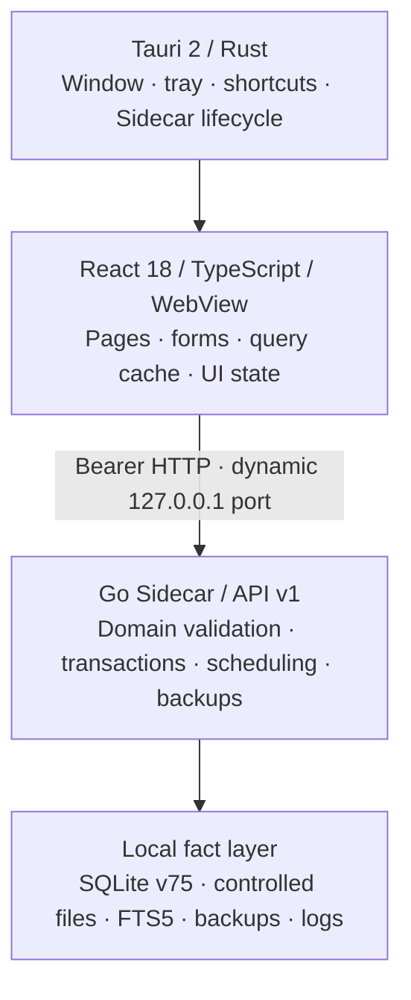

AI child-generation spawn and follow-up now share a bounded scheduler within each Sidecar: at most 8 active Provider attempts and 32 accepted queued jobs. Single and batch confirmations reserve capacity before their database transaction commits; a full queue leaves the proposal pending. The UI explains the rejection and preserves batch selection for a manual retry. Provider-busy backoff releases its slot, and unaccepted work is never replayed after restart. This does not limit ordinary chats or Task Agent Runs and is not a cross-instance quota; no schema, scope, API or Runner-wire change. See [H5-G41](docs/modules/ai-assistant.md#子智能体全局并发准入与有界排队h5-g412026-09-23部分实现).

Current source uses schema079 for complete next-message permission recommendations. Actionable Task Agent Run metadata is also projected into the unified Agent Inbox without output bodies, snapshots, files/paths, or Provider-private fields. Existing databases pass the backup gate before migration; request history is preserved. Update frontend and Sidecar together; use the pre-upgrade backup for rollback. See [AI module](docs/modules/ai-assistant.md).

A completed child generation with pending approvals does not satisfy the parent plan or resume it automatically. The parent receipt and sidebar expose only the count; the human must review the child proposals.

The parent agent and Agent workspace now show the count of still-actionable child approval proposals. A completed generation can still need human review in the child conversation. Only the count crosses the parent boundary; approval contents and authority do not. Any actionable child proposal blocks follow-up dispatch. See the [H5-G30 boundary](docs/modules/ai-assistant.md#子任务待审批阻塞可见性h5-g302026-09-22).

The parent agent can now use `workspace_agent_children(view=wait)` to wait up to 15 seconds for a confirmed child to reach a terminal state. It returns status metadata only; a committed child terminal fact also wakes the existing plan coordinator to re-read durable evidence. Waiting does not read the reply, renew permissions or start another model turn. See the [H5-G28 boundary](docs/modules/ai-assistant.md#子任务终态等待与计划唤醒h5-g282026-09-22).

The parent agent can now list its confirmed child conversations with a freshly authorized `workspace_agent_children` tool. Results default to the latest confirmed parent-authorized follow-up reply, or the initial delegation reply when no follow-up exists; `generation_id` can select an exact parent-authorized generation. The current turn must cover that reply's scopes, Provider/configuration version, and knowledge-source versions. Nonzero-offset pages require both `generation_id` and the full-reply digest. Child-initiated generations and file-bound permissions do not cross the parent boundary. Replies are untrusted model text, not execution or acceptance receipts, and are never merged automatically. API v1/schema079 and Runner wire are unchanged. See the [H5-G27 boundary](docs/modules/ai-assistant.md#父智能体读取子任务进展与首轮回复h5-g272026-09-22) and [H5-G29 pagination boundary](docs/modules/ai-assistant.md#子任务回复分页的一致性绑定h5-g292026-09-22).

The Agent workspace now shows a metadata-only list of child conversations for the current saved chat, with live generation status and manual parent/child navigation. Unavailable sessions are not linked. This is separate from the Task Agent Run ledger; navigation itself does not send messages, interrupt children, merge results or inherit permissions. Bounded waiting is described in G28 above. API v1 adds a read-only route; schema079 and Runner wire are unchanged. See the [H5-G26 boundary](docs/modules/ai-assistant.md#父子会话的只读导航与状态h5-g262026-09-22).

The AI assistant now supports one level of human-approved child conversation delegation and a narrowly scoped, separately confirmed follow-up to an existing child. A saved parent freezes the complete instruction, an explicit subset of this turn's permissions, and the Provider; separate human confirmation is required before each generation. Each parent is limited to four pending or confirmed delegations. There is no recursive delegation, inherited permission, automatic merge, or replay of an uncertain startup after restart. General child messaging/interrupts and real Provider/desktop acceptance remain pending. API v1/schema079 are unchanged. See the [H5-G25 contract](docs/modules/ai-assistant.md#受确认的有界子智能体委派h5-g252026-09-22).

Bound Windows desktop builds can now initiate a per-use, single-file operation from the trusted main WebView. AI replacement consumes an exact in-memory snapshot; v2 recovery consumes a one-shot review ticket. An independent Win32 window reviews the complete direction before `runas` requests UAC for that operation. The desktop launches only the same-directory helper bound to that build and accepts only a canonical receipt for the same operation ID over a one-shot pipe. Ordinary development builds have no embedded helper digest and stay read-only; CLI, model, Sidecar, and browser child WebViews cannot invoke the operation directly. Only one file operation may be active, cancellation is bound to its root and operation ID, explicit cancellation consumes the review, and every other launch/transport/receipt failure is treated as unknown and non-retryable. Internally the `prepared/materialized/recovery_intent/started/outcome` chain and v2 recovery intent still protect no-overwrite replacement and recovery. Stage data is unencrypted and its checksum is not tamper authentication. This deterministic slice did not invoke real UAC; cross-privilege SACL, installer, power-loss, and manual-recovery acceptance remain pending. See [product entry and boundaries](docs/modules/desktop-platform.md#绑定发行构建的按次单文件操作入口2026-09-22部分实现).

The single-file helper reserves attempts in `appLocalDataDir/workspace-file-attempts-v1` after native review. Up to 64 metadata-only records bind operation/review IDs, a request digest and registration time. They prevent cooperative cross-process retries and are never automatically deleted. They are not backups, execution receipts, or tamper-proof history; the bound product entry cannot bypass them. See [attempt journal boundaries](docs/modules/desktop-platform.md#辅助端持久尝试占用内部实现非执行回执).

The isolated Windows helper at `apps/file-security-helper` has no Tauri/WebView/model dependencies. Ordinary `--status` and `--verify-build` calls do not expose file operations; the only operation form is the six-field `--review-v1` bootstrap produced by the bound desktop, with no path or content in argv. `pnpm build:file-helper` produces an unbound standalone helper. On Windows, `pnpm build:desktop` generates a fresh in-memory signing key, embeds only its public key in the helper, embeds the helper digest in the desktop, then signs and verifies the final artifact pair. The private key is never exported, saved, or passed to child processes. `opc-desktop-build-binding.json` contains only a version, digests, and signature. Ordinary development remains unbound. This build-local signature is not Windows publisher signing or user approval. Installer/UAC and cross-privilege acceptance remain pending. See [build pair verification](docs/modules/desktop-platform.md#构建本地签名配对与只读自检部分实现).

Local recovery inspection reads experimental v1 and v2 records from separate `appLocalDataDir/workspace-file-recovery-v1` and `workspace-file-recovery-v2` directories (64 entries each). Missing directories are not created; records are not migrated or automatically deleted. They contain unencrypted content and paths outside business database backups. The v1 in-place recovery path remains permanently disabled. A bound desktop may consume an exact v2 review ticket only through independent native review and per-use UAC; ordinary development builds stay read-only. See the [v2 contract](docs/modules/desktop-platform.md#版本-2-替换记录只读集成).

Project-file AI editing remains constrained. Windows file previews connect to main-chat analysis through an exact snapshot, full disclosure review, provider/session-bound approval, and manual send. The model can propose one complete replacement bound to that baseline. After the user reviews the full diff, a bound desktop can enter independent native review and per-use UAC; it cannot autonomously traverse directories or bypass confirmation. The unsafe v1 in-place writer remains permanently disabled, while the product path uses the helper's no-overwrite object replacement. Real installer/UAC/SACL/power-loss acceptance remains pending, and ordinary development builds are read-only. Raw attachments and review cards are not saved to chat history; replies may quote them. See [current implementation boundary](docs/modules/ai-assistant.md#文件写入安全门禁与只读恢复检查2026-09-22部分实现).

<div align="center">
  

  <h1>opc-workspace</h1>

  <p><strong>A local-first workspace for one-person companies</strong></p>
  <p>Manage tasks, projects, clients, inbox workflows, focus time, and local business data in one offline-capable desktop app.</p>

  <p>
    <a href="./README.md">简体中文</a>
    ·
    <a href="./README.en.md">English</a>
    ·
    <a href="./docs/README.md">Product docs (Chinese)</a>
    ·
    <a href="./docs/opc-workspace-PRD.md">PRD (Chinese)</a>
  </p>

  <p>
    
    
    
    
    
    
  </p>
</div>

Agent-requested Chromium tab actions now show a local receipt only after the user confirms and the native command returns without error. That is not proof that a page finished loading. A user may separately bring a fixed, content-free result back into chat; failures keep the original request available. See [browser action receipts](docs/modules/ai-assistant.md#浏览器动作的本地执行回执与显式交接h5-e352026-09-21).

After confirming an agent-suggested Task Artifact, users can preview it in a right-side tab without leaving the chat, or open its exact submission page. The preview can now stage an identity-only follow-up in the same conversation; preparing the draft, choosing fresh access, and sending still require user actions. Preview content is never sent automatically, and file downloads remain manual. See [in-chat artifact follow-up](docs/modules/ai-assistant.md#右侧产出的原位智能体续办h5-e342026-09-21).

With per-message `workspace_ui+work+outputs` access, the agent can suggest opening an existing Task Artifact. Only after the user confirms does the app show that exact artifact in its submission's read-only view. File downloads remain manual, and model access to file contents requires a separate grant. See [exact artifact navigation](docs/modules/ai-assistant.md#任务产出的受确认精确定位h5-e322026-09-21).

With per-message work access, the agent can re-read up to 20 exact task IDs in one read-only snapshot, including current status, priority, dates, and versions. A missing task rejects the entire selection; changes still require separate action access and human approval. See [exact task selection](docs/modules/ai-assistant.md#已选任务精确成组读取h2-w122026-09-21).

The Tasks page can hand up to 20 manually selected task IDs to the agent. The user must still grant one-message access, send the prompt, let the agent re-read current facts, and approve any proposed batch change. Returning to Tasks in the same app session restores the previous view and selection only after every selected task has been re-read; any failure requires a fresh selection. The handoff itself changes no task. See [selected-task handoff](docs/modules/ai-assistant.md#已选任务交给智能体h2-w112026-09-21) and [return checkpoint](docs/modules/ai-assistant.md#已选任务返回断点h2-w132026-09-21).

The Tasks page and agent can set one priority or due time across a selected Task set. Due times require an explicit offset or can be cleared; agent changes still show per-Task previews for human approval and commit atomically. See the [batch Task facts contract](docs/modules/ai-assistant.md#批量优先级与截止时间h2-w102026-09-21).

With per-message work access, the agent can read current assignees, reviewers, and versions for up to 20 exact existing Tasks. Separate action access and one human approval can assign, reassign, or end the same responsibility across that set atomically. Assignment neither contacts people nor starts an Agent Run. See the [existing-Task batch responsibility contract](docs/modules/ai-assistant.md#已有任务成组责任变更h2-w92026-09-21).

With per-message work and action access, the agent can propose up to 20 new Tasks within one existing Project, each with an optional initial assignee. The approval card shows those assignments and, for assigned manual-review Tasks, the owner reviewer. A single human approval creates and assigns the whole batch atomically; the receipt links to each Task. Assignment does not contact people or start Agent execution. See the [batch creation and assignment contract](docs/modules/ai-assistant.md#批量建任务的可选初始分派h2-w82026-09-21).

The agent now loads the large workspace proposal schema only after accepting a relevant domain guide. Per-message permissions and individual human approval are unchanged. See the [tool catalog contract](docs/modules/ai-assistant.md#待确认操作工具按领域加载h5-g132026-09-21).

If repeated agent reads exceed the prompt budget after older conversation turns are removed, the runtime can replace earlier requeryable read-only results with a bounded, code-owned evidence capsule. It retains selected identities, versions, statuses, pagination boundaries, and digests while removing bodies and declaring itself incomplete and stale; results that cannot be safely compacted use an omission marker. The latest tool group and action, plan, and permission receipts stay intact, and the agent must re-query complete or current facts. The UI and successful reply disclose this without granting new access or automatic execution. See the [in-run result contract](docs/modules/ai-assistant.md#运行内较早只读结果收缩h5-g112026-09-21).

With per-message `work` access, the agent can query roadmap milestones by year, quarter, status, project, and archive state, with paged derived Task progress. Changes still require separate action access and individual human approval. See the [roadmap query contract](docs/modules/ai-assistant.md#路线图结构化查询h2-w42026-09-21).

Failed or retained Agent Runs can now start a linked new execution from current Task, assignee, model, and explicitly selected inputs, after a fresh preview and separate human confirmation. Actual submitted output can continue the original plan without rewriting history or approving the Task. See the [restart and plan contract](docs/modules/ai-assistant.md#当前事实执行与计划接续h5-f42026-09-21).

The agent can review managed UTF-8 output files up to 64 KiB with a separate, manually selected per-message grant. Reads verify current identity and file integrity before sending bounded text pages to the selected provider. This does not inherit existing permissions, access arbitrary files, or approve Tasks. See the [file review contract](docs/modules/tasks.md#ai-受控文件产出复查h5-f12026-09-21).

After a Task is returned for changes, a new Agent run can include the complete review feedback and explicitly selected previous outputs, with a separate preview and human confirmation. Previous submissions and runs remain intact, and new output still requires human review. File input consent remains independent; rework is not automatic or background scheduling. See the [rework execution contract](docs/modules/local-agents.md#退回意见驱动的新执行h5-f22026-09-21).

The builtin Agent executor now requires an explicit normal completion signal. Truncated, filtered or invalid responses are not registered as deliverables, and safe failure codes receive Chinese explanations in the UI. Compatible endpoints must return `finish_reason="stop"`; missing signals are rejected without automatic retries. See the [completion and failure contract](docs/modules/local-agents.md#执行完成信号与安全失败原因h5-f32026-09-21).

H3-C3 connects the disabled-by-default Agent failure diagnostic preset. Once explicitly enabled, future failed Runs create local Inbox items with exact Run navigation and a return to chat. Notification creation/retry never reruns a model or completes a Task. AI source lookup requires `work+outputs`; portable imports preserve historical evidence but exclude Agent Runs. See the [failure diagnostic contract](docs/modules/automation.md#agent-失败诊断闭环h3-c32026-09-21).

The independent AI track adds durable conversation plans (schema 076), immutable revisions, actual approval/execution receipts, and shared main/side-chat plan cards. H5-E1 queues each session's latest plan; H5-E2 deduplicates and surfaces actionable unplanned Runs, while H5-E37/H5-E38 remove superseded exact-retry and verified current-facts restart attempts from the attention badge without deleting history; H5-E3 adds plan-external pending approvals and each Task's current pending review; H5-E5/H5-E6/H5-E7/H5-E8 surface current automation, knowledge-index, saved-generation, and Provider failures. H5-E9 aggregates an actionable startup-restore diagnostic, while H5-E10 surfaces active system-maintenance Inbox incidents and opens their exact native Inbox details. H5-G52 later adds metadata-only `agent_run` projection for actionable Task Agent Runs, deduplicated between planned and unplanned views. H5-E4 keeps seven exact user-clicked workspace launchers; H5-E13 adds a per-message `workspace_ui` grant that may select only the same fixed panel, while H5-E14 adds a separate `workspace_browser` grant that may request one user-confirmed HTTP(S) browser tab. Neither reads or sends panel or webpage content, and H5-E14 cannot navigate automatically or control a terminal, browser, Git, or files. These flows do not automatically execute, retry, approve, review, restart, restore, clean up, alter Provider configuration, resolve maintenance incidents, read conversation, panel, backup, or knowledge content, inherit access, or continue in the background. This historical stage note described schema 078; the current source schema is 079. See the [AI assistant contract](docs/modules/ai-assistant.md).

H5-E15 connects the initial seven controlled Workbench record types to the agent: only a message that combines `workspace_ui` with matching `work` or `clients` read access can request those records. It sends only a type/ID pair; the client derives the internal route and requires a user confirmation before leaving chat while preserving a return session. It accepts no model-provided route, path, or URL and adds no record-content transfer, business write, or execution capability. Later additions are described in H5-E16/E17/E30.

H5-E16 extends that same user-confirmed location flow to an Agent Run only when a message has `workspace_ui+work+outputs`. The Sidecar derives the owner Task only by joining the existing Task server-side; neither model arguments nor the tool receipt receive that relationship, a route, execution body, or files. The client strictly validates the server-derived `task_id`, builds a fixed run-detail route, and navigates only after the user confirms. It adds no Run start, cancellation, retry, delivery recovery, review, or autonomous continuation.

H5-E17 extends the same confirmation card to a Task Submission only when a message has `workspace_ui+work+outputs`. The Sidecar derives the owner Task only by joining the existing Task server-side; neither model arguments nor the tool receipt receive that relationship, a route, submission summary, review rationale, Artifacts, or files. The client strictly validates the server-derived `task_id`, builds a fixed submission-detail route, and navigates only after the user confirms. It neither reads the detail nor submits, reviews, controls a Run, or continues autonomously.

H5-E30 extends the same user-confirmed navigation to project notes, client activities/follow-ups, ledger entries, and invoices. Each requires `workspace_ui` plus its matching `work`, `clients`, or independent `finance` read grant for that message. The Sidecar verifies the record and derives the parent of a note/activity/follow-up; the tool receipt contains no parent, content, amount, or route. Only a user click opens a fixed local detail route. Navigation grants no write, payment, external delivery, or Agent execution capability. See [exact record navigation](docs/modules/ai-assistant.md#智能体精确记录导航扩展h5-e302026-09-21).

H5-E18 refreshes a saved work plan immediately after it commits. The current chat stream receives only a generation ID, version, and step count, so the main plan card and right-side status mirror re-read the same session without waiting for the short poll. The receipt contains no title, steps, approvals, or workbench content, and adds no permission, execution, confirmation, recovery, or autonomous continuation.

H4-AQ lets a person safely hand off the address of the active Chromium tab to the agent. Only after an explicit handoff click, a second “include address” step, and manual send does the Provider receive the HTTP(S) address with query, fragment, and credentials removed. It carries no page title, body, screenshot, cookie, login state, history, download, tab/root ID, or local path, grants no workspace scope or browser/network capability, and cannot make the agent access, scrape, click, fill, or control a webpage.

H2-I/J/K lets a saved AI conversation propose Client create/update, create/update a local person identity, and link an existing active person as a Client contact or unlink it with a reason. Person reads expose only name, status, and version; existing notes and metadata never reach the Provider, and new notes must be explicitly supplied in the current request. Every command needs local confirmation and reuses native transactions; deactivation rechecks task responsibility, Client links, and planned follow-ups. H2-Q additionally admits permanent deletion of an inactive Client through a complete impact preview and separate human consent. Invoices, ledger entries, or any follow-up block deletion; Projects are detached, while local activities, contact-link history, attachment rows, and controlled files are removed with file restoration on failure. Owner/system/agent edits, account creation, external contact, and arbitrary attachment operations remain unavailable.

H2-L closes the Task-tag gap for AI task create/update. The model must first read real Tag candidates; the local confirmation card shows names, and confirmation rechecks both Tag facts and the Task version before reusing the native Task transaction. `tag_ids` is a complete replacement set, so an empty array clears all tags. H2-O additionally adds human-approved Tag creation, rename/recolor, and permanent deletion. Delete previews expose the number of detached Tasks and require a separate checkbox; confirmation recomputes the full impact and reuses the native Tag transaction. Deleting a Tag never deletes its Tasks. H2-P applies the same boundary to permanent deletion of archived Projects: the card exposes detach/delete/file effects and requires separate consent, then revalidates and reuses the native deletion transaction with attachment-file compensation. Tasks, draft invoices, and eligible ledger entries are detached rather than deleted.

H2-M closes the Task-hierarchy gap. AI can use a real Task ID to create a subtask, change its parent, or move it to the top level. The local confirmation card shows titles rather than UUIDs; confirmation rechecks versions, parent existence, recursive cycles, and the complete preview before reusing the native parent-chain coordination transaction.

H2-N adds permanent Task deletion to the same guarded approval path. The model may only propose deletion for an exact Task ID/version with empty changes. A local card enumerates child, submission, artifact, controlled-file, assignment, Run, focus, Inbox, and tag effects; deletion requires a separate human checkbox and reuses the native transaction. Changed effects or native active-reference guards invalidate the card, controlled files are restored on failure, and a successful receipt routes to the Task list rather than a deleted detail page.

H2-R adds permanent deletion of archived Content Items to the same guarded approval path. The model must use an exact Content Item ID/version and empty changes; the local card exposes preparation-Task links and source-Inbox effects and requires separate human consent. Active source items block deletion. Confirmation revalidates the full preview and reuses the native transaction while preserving linked Tasks, the Project, and Inbox audit snapshots; successful receipts route to the content calendar. H2-AD separately allows a proposal to record a locally published fact after the user reports an external publication. The user must independently verify the time and link and give separate consent before the native transaction records it. The app still does not publish externally or change Task state.

H2-S adds permanent deletion of archived roadmap milestones to the guarded approval path. The model must use the exact milestone ID/version and empty changes; the local card exposes Project-link and source-Inbox effects and requires separate human consent. Active source items block deletion. Confirmation revalidates the full preview and reuses the native transaction while preserving linked Projects, Tasks, and Inbox audit snapshots; successful receipts route to the roadmap list. H2-AC also lets the model propose same-quarter ordering using exact source/anchor versions and a complete-quarter preview; human confirmation reuses the native reorder transaction. Project/Task state changes remain unavailable.

H2-T adds Content Item preparation-Task relationships to the same approval path. The model must first read exact Content Item and Task IDs and versions, then separately propose linking, changing the required flag, or unlinking. The local card shows the Task name, status, version, and relationship transition; confirmation revalidates the complete preview and reuses the native relationship transaction. This capability changes only the relationship and Content Item version—it never creates, assigns, completes, cancels, or deletes the Task.

> [!IMPORTANT]
> opc-workspace is under active development. The current baseline is app v0.1.1, API v1, and SQLite schema v79. Migration 079 expands complete next-message permission recommendations behind the existing backup gate and preserves historical requests and decisions. Windows x64 can produce unsigned local test installers, but the project has not yet passed the release, signing, and cross-platform acceptance gates required for a production release. The AI assistant and local knowledge base are developed on independent tracks outside the v0.1–v0.4 product scope.

H5-G1 adds separately authorized, bounded background plan continuation: three generations/30 minutes by default, waiting for approvals, execution and output registration. Automatic turns have explicit provenance and do not take over manual drafts. Stop, no progress, drift, failure and budget limits end the lease; restarting requires fresh consent by default. H5-G12 adds a separate opt-in to resume only an idle waiting lease after an ordinary service restart, subject to the original time/turn limits and fresh fact checks. An in-flight request or backup restore always interrupts the lease; unknown requests are never replayed. Business actions remain individually approved, and stopping continuation does not cancel approved Agent Runs. API v1/schema078 and startup commands are unchanged. See the [continuation contract](docs/modules/ai-assistant.md#等待中自动续办的显式跨重启恢复h5-g122026-09-21).

H5-G8–G10 lets a bounded background turn leave a recoverable request for a missing workspace scope, then pauses while that request awaits human review. It does not consume the request or spend another model turn while waiting. In main or side chat, the person can explicitly click “Stop automatic continuation and review access”; only a confirmed stop prepares the draft and one-message permission panel. They must still review the grant and send the message themselves; the background turn cannot grant itself access or approve business actions. API v1/schema078 is unchanged. See the [permission handoff](docs/modules/ai-assistant.md#权限请求与自动续办的一步式人工交接h5-g102026-09-21).

H5-G3–G7 lets the agent request missing per-message workspace scopes in an interactive conversation. Main and side chat show a review card, recoverable after refresh for completed saved conversations; the Agent Inbox can return users to its source conversation without exposing scopes in the queue. Opening permission review or deferring the send keeps the request available; dismissing a live request also keeps it closed after the answer is saved. Only explicit dismissal or acceptance of a new message closes it. Access is possible only after the person confirms and sends a new message. The request itself grants nothing and background continuation has no interactive card. Schema078 adds only excluded operational recommendation state; startup commands are unchanged. See the [live access-request contract](docs/modules/ai-assistant.md#生成中忽略权限请求h5-g72026-09-21).

H5-G16 groups the existing workspace scopes into reading, actions, and sensitive content, with four shortcuts that only replace the unconfirmed draft selection. File bodies, finance, clients, knowledge, and Agent execution are never added by a shortcut. The user must still review and confirm each message, and mutations retain their separate approval. See the [consent UI contract](docs/modules/ai-assistant.md#工作台权限的常用选择与风险分组h5-g162026-09-21).

H5-G17 shows the complete, confirmed per-message workspace grant beside the send control in main and side chat. Unconfirmed selections are not shown as access, and the display disappears after the message is accepted. See the [pre-send grant display](docs/modules/ai-assistant.md#发送前显示本条工作台授权h5-g172026-09-21).

H5-G18 lets the agent load two distinct, already-authorized workspace domains with one guide call, reducing discovery turns for cross-module work. Two heavyweight combinations remain separate under the bounded prompt budget. Catalog selection does not grant access or bypass human approval. See the [joint guide contract](docs/modules/ai-assistant.md#跨领域联合指南与工具目录h5-g182026-09-21).

H5-G2 keeps up to ten terminal continuation results from the past 24 hours visible in a collapsed global status section, each linked to its saved conversation. A failed status read is shown as unknown rather than an empty list. This is read-only; it never retries, reauthorizes, or approves work. See the [result visibility contract](docs/modules/ai-assistant.md#后台续办结果可见性h5-g22026-09-21).

H2-W2 adds a read-only AI Today summary using the native Task/Focus calculation. A per-message `work` grant and user-confirmed IANA time zone are required; global overdue/due-soon counts are separate from the selected date's task counts. Individual tasks still need a separate query, and this does not add write authority or a database migration. See the [AI Today contract](docs/modules/ai-assistant.md#今日工作台概览读取h2-w22026-09-21).

H4-AR lets the user explicitly hand the Today page's selected date, IANA time zone and risk filter to the agent. A deep link returns to that exact native view; task rows and statistics are not copied, and the handoff neither sends a message nor grants permission or changes records automatically. See the [Today handoff](docs/modules/ai-assistant.md#今日视图到智能体的显式交接h4-ar2026-09-21).

H2-W3 lets the agent propose moving one active task before or after another in the same planned-date group. Only a separate human confirmation applies the native atomic reorder; changes to the complete group invalidate an old proposal. It does not reschedule or complete tasks. See the [AI task ordering contract](docs/modules/ai-assistant.md#任务顺序的人工确认h2-w32026-09-21).

The independent AI track now supports reading current/historical task assignments and proposing assignment, reassignment, or responsibility termination for explicit human approval. Shared domain transactions preserve versions, history, and parent-review rules. Assignment alone still does not start execution. In a saved conversation, a single message must explicitly grant work, output, action-proposal, and separate Agent-execution access before the model can read safe eligibility facts and propose a run. A person then reviews the frozen snapshot and gives an additional execution confirmation. Schema 74 freezes Task, Assignment, Actor, Adapter, and Provider identities; schema 75 atomically records successful output as either a precisely linked submission/artifact or a retained result with a stable reason, while transient delivery failures stay recoverable as pending. H5-C adds controlled current-Task file Artifact/current-Project Attachment input and one text/file result: no-file text runs stay on v1, while file capability uses strict v2. AI file access requires the separate one-message `agent_files` grant and an independent human file confirmation; the model sees only generation-and-Task-bound opaque candidates, and local/remote Providers disclose whether selected bytes leave the device. The process launches only after the approval transaction commits, and a successful Run never means the Task is complete. Arbitrary filesystem/Shell/browser/Git/terminal access, multiple-file output, multi-step orchestration, and live-model/desktop acceptance remain in progress. See the [Actor module](docs/modules/actors.md) and [Local Agent module](docs/modules/local-agents.md). Per-message output consent also enables submission history, paged summaries/review reasons, and exact-batch artifact metadata. Reading neither submits output nor accepts a review. Saved conversations with work, outputs, and action-proposal consent can also propose non-file submissions or acceptance/rework of the exact current submission. Full evidence requires personal verification and separate confirmation; shared transactions preserve task, assignment, parent, and Inbox effects. H4-F adds exact historical-submission navigation, on-demand output inspection, manual downloads, and return to the originating conversation. Viewing or downloading neither accepts a review nor restores AI permissions. See the [Task module](docs/modules/tasks.md). H2-F adds consented project-note reads and human-approved creation, editing and soft deletion, with full previews, version checks and shared domain transactions. H4-G now opens the exact note at `/projects/:projectId?note=:noteId`, validates both Project and Note identity, and reads it independently of the current list page or filter. Deleted notes expose deletion metadata but no body. Only the UI may append return-to-conversation context; viewing or returning executes no action and restores no AI permission. See the [Project module](docs/modules/projects.md#ai-项目笔记桥接h2-f).

H2-C5 adds human-approved, snapshot-bound Inbox “mark all read.” The model may only copy the cutoff returned by the server-side Inbox search; the approval card binds the global candidate count and a SHA-256 fingerprint of candidate IDs and versions. A changed selection invalidates the old card. Execution reuses the native transaction, changes only read facts, and conservatively excludes items created or changed after the snapshot. Because the batch has no single Inbox entity, the Proposal is the durable receipt identity and the specialized receipt reports the actual cutoff and count. API v1 and schema 73 are unchanged; broader autonomous orchestration remains pending. See the [Inbox module](docs/modules/inbox.md#ai-独立轨道快照式全部已读adr-029-h2-c5).

H4-H preserves the originating AI conversation when opening projects, clients, Inbox items, reminders, content items and milestones. Detail dialogs and read failures offer a return action; closing the detail retains it on the page. See the [AI assistant module](docs/modules/ai-assistant.md#h4-h-业务记录与来源对话往返).

H4-I/H4-R–X/H4-AF–AQ continue to expand human-triggered native-detail handoff to the agent. Only the exact record identity or safe page-level status and a fixed prompt are staged in memory. Preparing the request appends to the existing draft, clears previous grants and selected context, and opens fresh per-message consent; sending remains manual. Local-person handoff carries only the person ID and never copies notes or metadata; local Agent, AI provider, data/backup settings, and runtime diagnostics handoff carry only IDs/page state, never copy configuration, secrets, backup contents, paths, logs, diagnostic packages, or import/export files, and never grant check/enable/disable/connection-test/run-start/backup/restore/import/export/restart authority. H4-AM/H4-AN/H4-AO/H4-AQ are narrow explicit snapshot exceptions for displayed Git, text preview, recent terminal-output tail, or the active browser address only; H4-AQ strips query/hash/credentials and excludes page body, cookies, login state, history, downloads, tab/root IDs, and paths, while H4-AO excludes PTY/root IDs, paths and input. Neither grants Shell or browser control. H4-AP also presents active-main-session plan metadata read-only in the right-side Agent Run ledger and only links back to the source conversation; it grants no send, approval, or Run control. Relevant unsaved edits and pending mutations prevent leaving the detail. Navigation alone does not call a model or mutate business facts. See the [handoff contract](docs/modules/ai-assistant.md#h4-i-从工作台事项进入智能体).

H5-C update (2026-09-20): this supersedes the earlier H5-C single-file wording above; bounded multi-file output is now delivered. No-input text remains execution contract v1; controlled input or one file remains v2; v3 freezes 2–4 safe UTF-8 output names/MIME values and order. The model returns only an ordered JSON array of bodies, never paths or file metadata. Delivery creates one human-review Submission with multiple Artifacts; the legacy Run artifact ID points to the first Artifact and the event records all IDs. Pending recovery revalidates the original v3 payload, and the task UI previews/downloads files by their frozen names. This does not add filesystem, Shell, browser, Git, terminal, autonomous scheduling, or multi-step execution authority.

## Why opc-workspace

Independent developers, freelancers, creators, and consultants often jump between task apps, project spreadsheets, client records, timers, and content calendars. opc-workspace brings those frequent workflows into a lightweight desktop app while keeping business data on the user's own computer by default.

- **Local-first:** core workflows work offline, with business facts stored in local SQLite and controlled file storage.
- **One workspace:** tasks, projects, clients, inbox items, focus sessions, and reminders share the same business facts.
- **Auditable workflows:** assignments, state changes, deliverables, reviews, and rework remain traceable.
- **No development runtime for end users:** production installers bundle the React frontend and Go Sidecar; users do not need Docker, Node.js, Go, or Rust.
- **Keyboard-friendly:** the app includes a command palette, quick task creation, and desktop global shortcuts.

`OPC` stands for **one-person company**. The product is designed around the realities of running a business alone, rather than being a smaller copy of team collaboration software.

## Core capabilities

| Area                 | Current capabilities                                                                                                                                                                           |
| -------------------- | ---------------------------------------------------------------------------------------------------------------------------------------------------------------------------------------------- |
| Today workspace      | Brings together overdue, scheduled, later-this-week, and unscheduled tasks with planning and quick actions                                                                                     |
| Tasks and review     | Six-state lifecycle, parent-child tasks, assignments, deliverable submission, manual review, and rework                                                                                        |
| Projects and clients | Project progress and artifacts, attachments, client records, activities, follow-ups, and related views                                                                                         |
| Inbox and reminders  | Local triage, snoozing, task splitting, completion progress, and recurring reminders                                                                                                           |
| Focus and time       | Recoverable focus sessions, task binding, history, trends, project breakdowns, and tag breakdowns                                                                                              |
| Search and commands  | Local search across tasks, projects, clients, and active inbox items, with direct navigation                                                                                                   |
| Data safety          | Versioned migrations, controlled files, full backup and restore, business JSON/ZIP transfer, and diagnostics                                                                                   |
| Local automation     | Only code-owned, constrained presets; no arbitrary Shell, SQL, HTTP, or external-send actions                                                                                                  |
| AI assistant         | Remote/local providers, streaming chat, memory, explicit context, local-only quality evaluation with trends/categories/failure reasons, content-free run steps/usage, and confirmed task cards |

### Current boundaries

Main and side chats now show live model/tool/self-check/citation progress with matching recovery sequences. Interrupted steps remain unconfirmed until recovery; progress contains no tool arguments or results and never approves business actions. See the [run progress contract](./docs/adr/012-ai-run-steps-and-local-metrics.md).

- The v0.1 manual workflow is still being refined. See the [module status overview](./docs/modules/README.md) for the current implementation baseline.
- Income, expenses, and invoices remain assigned to v0.4, but local ledger/statistics, invoice transitions with atomic payment recording, PDF and due-Inbox foundations are implemented in source. Full acceptance and enhancements remain pending. AI H3-E1 adds independent read-only finance consent and exact report/detail navigation; H3-E2 adds separately authorized, human-approved ledger create/update/void with full local previews and shared transactions. H3-E3 adds independent invoice consent, draft create/update and sent/viewed/paid/overdue proposals with human approval, atomic payment bookkeeping and due-Inbox resolution. Overdue events retain existing enabled automation rules; approval is not evidence of automation success. H3-E4A adds separately confirmed permanent deletion of unlinked drafts and their controlled PDF, with shared transactions, file compensation and retained approval/audit history. H3-E4B adds separately approved local PDF generation/replacement, shared file compensation, immutable artifact receipts and human-only exact downloads. Replaced/missing/corrupt files cannot silently substitute a later PDF. H3-E5 adds independently authorized CSV proposals with explicit filters, human approval, and exact-content downloads. Changed data requires a fresh proposal; CSV bodies are neither retained nor sent to the model. Full acceptance remains pending; no stage performs external payments or automatic sending. See the [finance contract](./docs/modules/finance-invoices.md).
- The independent AI assistant track includes remote/local providers, streamed replies and reasoning, a constrained harness with scope-filtered on-demand domain guidance, three memory tools, segmented summary/fact compaction, explicit business/knowledge context, answer-level citations, and content-free run steps, usage summaries and UTC trends. Core safety rules stay resident while the read-only `workspace_guide` supplies detailed domain rules and the large proposal schema as needed; the fixed maximum-scope initial request test keeps at least 32 KiB of headroom. Dataset v4 provides an 8-case smoke suite, four 6-case topic suites and a 24-case full suite. Quality evidence is grouped by provider configuration, dataset and suite; bounded fact rules, Wilson intervals and human decisions are review aids, not general semantic proofs or release approval. Missing usage stays unknown and no costs are estimated.
- On Windows desktop, the embedded Chromium workspace can explicitly stage a bounded snapshot of visible page text and up to 20 visible HTTP(S) links for review. Query/fragment components are removed and credential-bearing links are rejected. Nothing is sent until the user stages the reviewed handoff and manually sends it; the page does not grant browser control or cause automatic navigation.
- [ADR-025](./docs/adr/025-ai-reliability-confirmations-and-evaluation-identity.md) adds run-wide budgets and explicit stream outcomes, application-wide stop/recovery controls, atomic task confirmation, durable memory decisions and progress through oversized history turns. Model network waits do not hold the global maintenance lock. Tasks require explicit user confirmation and domain validation; non-persistent chat text and tool memory remain in runtime memory. Automated checks use isolated fixtures; real model quality, native WebView input methods and real crash scenarios still require platform testing. The local knowledge base text baseline and PDF page-level extraction (ADR-026) are delivered; authorized references and source change detection remain pending.
- The local Agent area ships a Windows builtin executor, task/run UI, bounded text/file/files submission, manual review and recoverable output registration. H5-F6 allows explicitly selected accepted predecessor Task files within the same project, with independent consent, one-message AI `agent_project_files`, frozen v6 provenance and deletion protection. Both OpenAI and Anthropic support v6; old v1–v4 keep their OpenAI meaning and v5 keeps the remote Anthropic/8192-token contract. Existing file budgets are shared, not increased. Single-request execution requires a complete response; exact retry/restart revalidate identity and input, and success is not task acceptance. H5-F7 lets a user take one submitted file output into the right-side Files workspace, choose an existing target, review the full replacement diff, and—only in a bound release build—continue through the per-use native review/UAC/helper chain. It never writes automatically or accepts the Task submission. H5-F8 connects exact Run/Submission receipts in the plan and right-side Run detail to the existing manual review page with return-to-chat context; it still never auto-accepts or continues execution. See the [execution contract](./docs/modules/local-agents.md#同项目已验收文件交接h5-f62026-09-21), [H5-F7 file bridge](./docs/modules/local-agents.md#已提交文件产出到项目文件的人工桥接h5-f72026-09-22), and [H5-F8 review roundtrip](./docs/modules/local-agents.md#计划执行与人工验收的精确往返h5-f82026-09-22). Real-provider/native acceptance, macOS/Linux, external runners, autonomous scheduling and arbitrary tools remain pending.
- There is no cloud sync, multi-user account system, online workflow, or remote message sending.

The assistant can also read built-in automation rules and bounded Run metadata, and propose enable/disable or limited configuration changes for human approval. Enabling or updating an enabled rule requires separate consent to continuing local effects. Disabling does not revoke captured event deliveries; failed Runs can be retried after separate human consent to the complete original snapshot. Approval and actual attempt success/failure are distinguished; business snapshots are never sent to the model. Exact rule/Run links now open the shared local inspector, preserve attempt navigation, and return to the source chat without executing an action. See the [automation contract](./docs/modules/automation.md).

Verified AI citations open exact versioned chunks locally and retain PDF page coordinates. Per-message knowledge consent now allows the model to search/read 1–20 explicitly selected versioned sources. Only successfully delivered full chunks become citation evidence; search excerpts do not. Results follow the selected provider's transfer boundary, and dynamic tool bodies are not separately saved as context snapshots. Ephemeral citation cards and short-lived in-memory metadata recovery are now supported without persisting text or citations; partial replies are never promoted to complete. Real-model acceptance remains pending; see the [knowledge contract](./docs/modules/knowledge-base.md).

## Quick start

### Development requirements

| Dependency                | Version                                            |
| ------------------------- | -------------------------------------------------- |
| Node.js                   | 20.19–26                                           |
| pnpm                      | 10+ (the repository pins `pnpm@11.21.0`)           |
| Go                        | 1.22+                                              |
| Rust                      | 1.85+, installed through rustup/cargo              |
| Tauri system dependencies | Tauri 2 prerequisites for Windows, macOS, or Linux |

Windows desktop builds also require the WebView2 Runtime, Visual Studio C++ Build Tools, and the Windows SDK.

### Install dependencies

```powershell
pnpm install
go -C services/sidecar mod download
```

### Start the desktop development environment

```powershell
pnpm dev
```

The unified development script starts the Go Sidecar, Vite, and Tauri. Development data is kept under the ignored `.local/dev-data/` directory, separate from production application data, and no demo business records are created automatically.

To run only the Sidecar and browser frontend:

```powershell
pnpm dev:web
```

## Build and verify

```powershell
# Build the Sidecar, web frontend, and desktop installers for this platform
pnpm build

# Source gate that does not require a Rust linker
pnpm check:source

# Full gate, including Cargo check and Rust tests
pnpm check
```

Layer-specific commands include `pnpm check:web`, `pnpm check:go`, `pnpm check:rust`, and `pnpm check:docs`.

The current Windows x64 build produces:

```text
apps/desktop/src-tauri/target/release/bundle/nsis/opc-workspace_0.1.1_x64-setup.exe
apps/desktop/src-tauri/target/release/bundle/msi/opc-workspace_0.1.1_x64_zh-CN.msi
```

The NSIS installer currently includes Simplified Chinese only, and the MSI uses `zh-CN`. Both are unsigned local test packages. Cross-platform releases must still be built on the relevant platform or CI runner and pass clean-system install, launch, upgrade, uninstall, and data-retention acceptance checks.

## Architecture



In production, Tauri starts and supervises the bundled Go Sidecar. The Sidecar listens only on loopback and uses a fresh random session token for each process generation. The React UI accesses local business capabilities through the versioned `/api/v1`. Databases, attachments, backups, and logs live in the operating system's application data directories, separate from the installation directory.

The agent can query explicitly authorized workspace records and propose task or project creation, edits, scheduling, and lifecycle commands. Each change requires a separate human confirmation, bound to an immutable proposal and the target version. Completing a project with unfinished tasks requires an additional human checkbox and never completes those tasks. Customer association requires the clients scope; contract amounts are not exposed. Schema 072 stores approvals for durable replay; ephemeral chats cannot propose these actions. Inbox creation, edits, read/snooze/unsnooze/resolve/dismiss/reopen also use this approval flow, preserving version, time and required-task guards without changing related tasks or source records. File and terminal permissions are not inherited. Inbox task linking, required-flag edits and soft unlinking are now supported, binding both Inbox/Task versions and the displayed progress/automatic-resolution effect. Active and historical relations are available through an explicitly authorized paginated read tool. Atomic Inbox splitting now supports 1–20 drafts with hierarchy, tags, scheduling and initial assignments, reviewed as one batch. Authorized actor/tag lookup exposes only IDs, labels, types and versions; confirmation rejects changed references and rolls back the whole batch on failure. Person assignments are local records, and agent assignments do not start execution. Local Reminder lookup and human-approved creation, rescheduling, recurrence edits and cancellation now reuse the native transactional commands, including timezone, version and terminal-state checks. Cancellation stops future occurrences without deleting history; it does not add external notifications. Other business operations and multi-step orchestration remain in progress.

Authorized Focus queries read real sessions and terminal history. Human-approved start, pause/resume, stop/cancel and crash recovery share native domain transactions. Starting a new local cycle and including an uncertain gap require separate consent. Stop credits confirm-time work without completing the task; cancel/interrupt do not credit it. Live Session identity coordinates local cycles; historical approvals never replay them. Authorized period-report tools now share the Focus page's completed-only aggregates for explicit local dates (1–93 days) and IANA timezone, with bounded dimension pages and current project/tag attribution. Direct local-break control, report-filter deep links and real-model acceptance remain pending.

For the complete module and security model, see the [functional architecture](./docs/functional-architecture.md), the [local Agent Runtime ADR](./docs/adr/003-local-agent-runtime-security.md), and the [AI assistant module documentation](./docs/modules/ai-assistant.md). These documents are currently maintained in Chinese.

The assistant can query global execution status and propose stopping one execution for separate human confirmation. Cancellation intent is durable, does not cancel the Task, and is displayed separately from a stopped executor. Automatic retries and autonomous multi-step execution are not implied.

Failed, cancelled or interrupted Agent Runs can now be proposed for a human-approved retry using the original execution identity and input/output contract. File-enabled retries require fresh message-level authorization and input-file consent. Approval creates a new linked attempt, never replaces the original record, and does not rerun results awaiting delivery. See the [AI assistant contract](docs/modules/ai-assistant.md).

Main and side conversations can also propose recovery of pending output delivery. Separate human consent processes the stored result locally without another model call; approval and delivery share one transaction. The actual outcome is submitted or retained, never automatic acceptance or Task completion, and replay does not duplicate output.

## Repository layout

The independent AI track supports explicitly authorized, paginated Client activity/followup reads and human-confirmed followup creation, edits, cancellation, skipping, completion with an optional next plan, and atomic rescheduling. Completion additionally requires the human to attest to the actual result and timestamp. Commands share native transactions and refresh Client/Inbox facts; they never contact customers or invent communication. Manual note/meeting creation, edits and reasoned soft deletion are now human-approved; deletion requires separate consent and preserves history and attachments. Exact record navigation remains pending. See the [followup contract](./docs/modules/client-followups.md).

```text
apps/
  web/                    React 18 + TypeScript + Vite + Tailwind CSS v4
  desktop/                Tauri 2 shell and Rust lifecycle management
services/
  sidecar/                Go HTTP API, SQLite, migrations, controlled files, and tests
scripts/                  Development orchestration, builds, formatting, and doc checks
docs/                     PRD, architecture, ADRs, and module documentation (Chinese)
.local/dev-data/          Local development data (Git-ignored)
```

## Documentation

- [Documentation center](./docs/README.md): reading order, source-of-truth rules, and module status overview (Chinese).
- [Product requirements, PRD v10.12](./docs/opc-workspace-PRD.md): product scope, version boundaries, and implementation tracking (Chinese).
- [Functional architecture](./docs/functional-architecture.md): module relationships, event flows, and fact ownership (Chinese).
- [Module documentation](./docs/modules/README.md): workflows, APIs, states, dependencies, and acceptance criteria (Chinese).
- [Sidecar developer documentation](./services/sidecar/README.md): local API, data, and backend verification notes.
- [中文 README](./README.md): the Simplified Chinese project overview.

The documentation distinguishes implemented, partially complete, UI-only, and planned capabilities. When sources differ, code and tests are authoritative for current implementation facts, while the PRD defines product scope and target contracts.

## Contributing

The project is evolving quickly. Before starting a large change, read the [product documentation](./docs/README.md) and align the scope through [GitHub Issues](https://github.com/DingxinTao0417/opc-workspace/issues). Feature changes must update the relevant PRD, architecture, or module documentation and run checks proportional to their risk.

## License

This repository does not currently include a `LICENSE` file. Source availability does not grant permission to copy, modify, redistribute, or use it commercially; the project owner must choose and publish a license separately.
