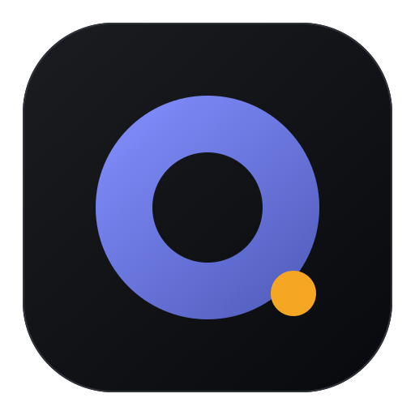
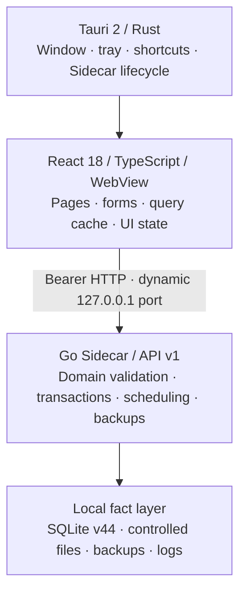

<div align="center">
  

  <h1>opc-workspace</h1>

  <p><strong>A local-first workspace for one-person companies</strong></p>
  <p>Manage tasks, projects, clients, inbox workflows, focus time, and local business data in one offline-capable desktop app.</p>

  <p>
    <a href="./README.md">简体中文</a>
    ·
    <a href="./README.en.md">English</a>
    ·
    <a href="./docs/README.md">Product docs (Chinese)</a>
    ·
    <a href="./docs/opc-workspace-PRD.md">PRD (Chinese)</a>
  </p>

  <p>
    
    
    
    
    
    
  </p>
</div>

> [!IMPORTANT]
> opc-workspace is under active development. The current baseline is app v0.1.1, API v1, and SQLite schema v44. Windows x64 can produce unsigned local test installers, but the project has not yet passed the release, signing, and cross-platform acceptance gates required for a production release.

## Why opc-workspace

Independent developers, freelancers, creators, and consultants often jump between task apps, project spreadsheets, client records, timers, and content calendars. opc-workspace brings those frequent workflows into a lightweight desktop app while keeping business data on the user's own computer by default.

- **Local-first:** core workflows work offline, with business facts stored in local SQLite and controlled file storage.
- **One workspace:** tasks, projects, clients, inbox items, focus sessions, and reminders share the same business facts.
- **Auditable workflows:** assignments, state changes, deliverables, reviews, and rework remain traceable.
- **No development runtime for end users:** production installers bundle the React frontend and Go Sidecar; users do not need Docker, Node.js, Go, or Rust.
- **Keyboard-friendly:** the app includes a command palette, quick task creation, and desktop global shortcuts.

`OPC` stands for **one-person company**. The product is designed around the realities of running a business alone, rather than being a smaller copy of team collaboration software.

## Core capabilities

| Area                 | Current capabilities                                                                                         |
| -------------------- | ------------------------------------------------------------------------------------------------------------ |
| Today workspace      | Brings together overdue, scheduled, later-this-week, and unscheduled tasks with planning and quick actions   |
| Tasks and review     | Six-state lifecycle, parent-child tasks, assignments, deliverable submission, manual review, and rework      |
| Projects and clients | Project progress and artifacts, attachments, client records, activities, follow-ups, and related views       |
| Inbox and reminders  | Local triage, snoozing, task splitting, completion progress, and recurring reminders                         |
| Focus and time       | Recoverable focus sessions, task binding, history, trends, project breakdowns, and tag breakdowns            |
| Search and commands  | Local search across tasks, projects, clients, and active inbox items, with direct navigation                 |
| Data safety          | Versioned migrations, controlled files, full backup and restore, business JSON/ZIP transfer, and diagnostics |
| Local automation     | Only code-owned, constrained presets; no arbitrary Shell, SQL, HTTP, or external-send actions                |

### Current boundaries

- The v0.1 manual workflow is still being refined. See the [module status overview](./docs/modules/README.md) for the current implementation baseline.
- Income, expenses, and invoicing remain future business modules and must not be treated as delivered features.
- The AI assistant and knowledge base have not been implemented. The current version does not call an AI/LLM or run an Agent.
- The local Agent area currently contains constrained Adapter registration and diagnostics only—there is no Runner, Agent Run, or executable task capability.
- There is no cloud sync, multi-user account system, online workflow, or remote message sending.

## Quick start

### Development requirements

| Dependency                | Version                                            |
| ------------------------- | -------------------------------------------------- |
| Node.js                   | 20.19–26                                           |
| pnpm                      | 10+ (the repository pins `pnpm@11.21.0`)           |
| Go                        | 1.22+                                              |
| Rust                      | 1.85+, installed through rustup/cargo              |
| Tauri system dependencies | Tauri 2 prerequisites for Windows, macOS, or Linux |

Windows desktop builds also require the WebView2 Runtime, Visual Studio C++ Build Tools, and the Windows SDK.

### Install dependencies

```powershell
pnpm install
go -C services/sidecar mod download
```

### Start the desktop development environment

```powershell
pnpm dev
```

The unified development script starts the Go Sidecar, Vite, and Tauri. Development data is kept under the ignored `.local/dev-data/` directory, separate from production application data, and no demo business records are created automatically.

To run only the Sidecar and browser frontend:

```powershell
pnpm dev:web
```

## Build and verify

```powershell
# Build the Sidecar, web frontend, and desktop installers for this platform
pnpm build

# Source gate that does not require a Rust linker
pnpm check:source

# Full gate, including Cargo check and Rust tests
pnpm check
```

Layer-specific commands include `pnpm check:web`, `pnpm check:go`, `pnpm check:rust`, and `pnpm check:docs`.

The current Windows x64 build produces:

```text
apps/desktop/src-tauri/target/release/bundle/nsis/opc-workspace_0.1.1_x64-setup.exe
apps/desktop/src-tauri/target/release/bundle/msi/opc-workspace_0.1.1_x64_zh-CN.msi
```

The NSIS installer currently includes Simplified Chinese only, and the MSI uses `zh-CN`. Both are unsigned local test packages. Cross-platform releases must still be built on the relevant platform or CI runner and pass clean-system install, launch, upgrade, uninstall, and data-retention acceptance checks.

## Architecture



In production, Tauri starts and supervises the bundled Go Sidecar. The Sidecar listens only on loopback and uses a fresh random session token for each process generation. The React UI accesses local business capabilities through the versioned `/api/v1`. Databases, attachments, backups, and logs live in the operating system's application data directories, separate from the installation directory.

For the complete module and security model, see the [functional architecture](./docs/functional-architecture.md) and the [local Agent Runtime ADR](./docs/adr/003-local-agent-runtime-security.md). Both documents are currently maintained in Chinese.

## Repository layout

```text
apps/
  web/                    React 18 + TypeScript + Vite + Tailwind CSS v4
  desktop/                Tauri 2 shell and Rust lifecycle management
services/
  sidecar/                Go HTTP API, SQLite, migrations, controlled files, and tests
scripts/                  Development orchestration, builds, formatting, and doc checks
docs/                     PRD, architecture, ADRs, and module documentation (Chinese)
.local/dev-data/          Local development data (Git-ignored)
```

## Documentation

- [Documentation center](./docs/README.md): reading order, source-of-truth rules, and module status overview (Chinese).
- [Product requirements, PRD v9.84](./docs/opc-workspace-PRD.md): product scope, version boundaries, and implementation tracking (Chinese).
- [Functional architecture](./docs/functional-architecture.md): module relationships, event flows, and fact ownership (Chinese).
- [Module documentation](./docs/modules/README.md): workflows, APIs, states, dependencies, and acceptance criteria (Chinese).
- [Sidecar developer documentation](./services/sidecar/README.md): local API, data, and backend verification notes.
- [中文 README](./README.md): the Simplified Chinese project overview.

The documentation distinguishes implemented, partially complete, UI-only, and planned capabilities. When sources differ, code and tests are authoritative for current implementation facts, while the PRD defines product scope and target contracts.

## Contributing

The project is evolving quickly. Before starting a large change, read the [product documentation](./docs/README.md) and align the scope through [GitHub Issues](https://github.com/DingxinTao0417/opc-workspace/issues). Feature changes must update the relevant PRD, architecture, or module documentation and run checks proportional to their risk.

## License

This repository does not currently include a `LICENSE` file. Source availability does not grant permission to copy, modify, redistribute, or use it commercially; the project owner must choose and publish a license separately.
