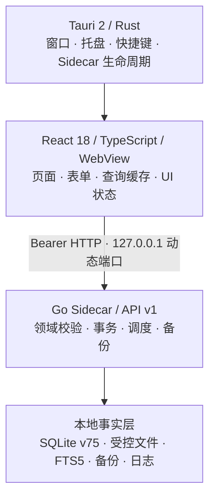

<!-- Current source schema: 079. Historical stage notes below retain their original versions. -->

后台计划续办现在以 metadata-only `continuation` 项进入统一 Agent Inbox；左侧“后台续办”可精确回到原会话计划并通过只读 handoff 重新核对，不继承权限或自动执行。详见 [H5-G54](docs/modules/ai-assistant.md#后台计划续办纳入统一-agent-inboxh5-g542026-09-23)。

Task Agent Run 的活动、未被精确 retry 替代的失败/中断，以及 `pending`/`retained` 交付现以 metadata-only `agent_run` 项汇入统一 Agent Inbox；计划内 Run 还能通过重新授权 handoff 回到 AI；不返回正文、输入快照、文件/路径或 Provider 私密字段。

执行详情现在可从 retry Run 回看服务端确认的精确父 Run，不会自动重试、恢复或继承权限。

AI 子智能体 spawn/follow-up 现受 Sidecar 进程内并发队列保护：最多 8 个活动 Provider 尝试、32 个排队项；单项或批量确认会在事务提交前预留容量，满载则回滚且保持待确认。H5-G50 仅恢复带持久排队事件、无 Generation、无 Provider 受理事件且无父方停止意图的新 spawn；已受理请求、follow-up 与旧版无事件记录不重放。父方停止意图先落工作流事件再发信号。H5-G51 为普通聊天先持久化显式停止意图再取消；续办在等待维护写锁时可先撤销进程内 worker，worker 先收尾时停止事务回看精确最新轮次幂等补记事件，但只在 durable 状态提交后确认请求。重启可区分主动停止与意外/未确认中断，均不重放。此运行时上限不涵盖普通聊天/Task Agent Run，也不跨进程；无新增 schema、scope 或 Runner wire。详见 [H5-G41](docs/modules/ai-assistant.md#子智能体全局并发准入与有界排队h5-g412026-09-23部分实现)、[H5-G50](docs/modules/ai-assistant.md#已确认子委派的安全启动恢复h5-g502026-09-23部分实现) 与 [H5-G51](docs/modules/ai-assistant.md#普通生成停止意图的持久化h5-g512026-09-23部分实现)。

父会话右侧现可经两步人工确认，向当前由父方已确认授权的精确活动子 Generation 请求本机停止；服务端重验父子关系，202 仅表示已请求，不等于 Generation 终态或远程请求撤回。不会触及 Task Agent Run、子会话独立轮次或自动级联。见 [H5-G32 边界](docs/modules/ai-assistant.md#父子会话的显式停止请求h5-g322026-09-22部分实现)。

子会话模型回复完成但仍有待审批建议时，父计划步骤保持未满足、自动续办等待人工处理；确认回执和右栏均只显示数量，不代用户审批。

父智能体和右侧“Agent 执行”现可看到子会话中仍有效的待人工审批数量；`completed` 只表示生成结束，出现待核对项需人工打开子会话逐项处理。父智能体另可通过专用工具提出向已确认子会话续交办，前端完整展示新指令/权限/Provider 并要求人工另行确认；待审批操作会阻断发送。父会话在本条重新授权下可读取最新已确认续交办回复，也可指定精确轮次；回复不会自动合并到父对话或作为业务事实。见 [H5-G31 边界](docs/modules/ai-assistant.md#已有子会话续交办h5-g312026-09-22部分实现)。

父智能体现在还能用 `workspace_agent_children(view=wait)` 有界等待已确认子任务终态（最长 15 秒），只接收状态；子任务终态提交后会无载荷唤醒已有计划续办器重新核验事实。等待不读取回复、不自动续授权或创建模型任务；见 [H5-G28 边界](docs/modules/ai-assistant.md#子任务终态等待与计划唤醒h5-g282026-09-22)。

父智能体现在可在本条显式授权下，用 `workspace_agent_children` 列出自己已确认的子任务状态；结果页默认读取最新已确认的父方续交办回复，无续交办时读取首轮，也可传 `generation_id` 选择精确父方授权轮次。读取时按该轮重新核验 scope、Provider/配置版本与知识来源；非零偏移续页必须带 `generation_id` 和完整正文摘要，避免拼接漂移回复。不会读取子会话自行运行的 Generation；逐份文件授权不自动跨会话转交；结果是不可信模型文本，不自动合并、执行或验收。schema079/API v1/Runner wire 不变，见 [H5-G27 边界](docs/modules/ai-assistant.md#父智能体读取子任务进展与首轮回复h5-g272026-09-22)与[H5-G29 分页一致性](docs/modules/ai-assistant.md#子任务回复分页的一致性绑定h5-g292026-09-22)。

智能体右侧“Agent 执行”现可只读查看当前保存对话的子会话及真实生成状态，并在父子对话间手动往返；不可用会话不生成跳转。该会话树与 Task Agent Run 账本分离；其导航本身不发送消息、中断子任务、自动合并结果或继承权限，有界等待另见上方 G28。API v1 新增只读关系路由，schema079/Runner wire 不变。见 [H5-G26 边界](docs/modules/ai-assistant.md#父子会话的只读导航与状态h5-g262026-09-22)。

AI 助手现支持一层受人工确认的子对话委派：保存主会话在本条显式授权下冻结完整指令、范围子集与 Provider，用户逐项确认后才创建独立子会话并启动一次生成；最多四项，无递归、隐式权限继承或自动合并。普通重启只恢复有持久排队事实、明确未受理且未停止的新 spawn；已受理或结果不确定的模型请求、follow-up 与旧版无排队事件记录不重放。通用子代理通信/中断、真实 Provider/桌面专项仍待；API v1/schema079 不变。见 [H5-G25 契约](docs/modules/ai-assistant.md#受确认的有界子智能体委派h5-g252026-09-22) 与 [H5-G50 恢复边界](docs/modules/ai-assistant.md#已确认子委派的安全启动恢复h5-g502026-09-23部分实现)。

绑定的 Windows 桌面发行构建现可从可信主 WebView 发起**按次、单文件**操作：AI 替换消费本机精确快照，版本 2 恢复消费本机单次票据；随后独立 Win32 窗口复核完整方向，再通过 `runas` 请求本次 UAC。桌面只启动同目录且与本次构建绑定的 helper，并通过一次性管道接受同一 operation ID 的规范回执。普通开发构建无绑定摘要，自动保持只读；CLI、模型、Sidecar 和浏览器子 WebView 不能直接调用。全局只允许一个在途文件操作，可按 root/operation 精确请求取消；明确取消要求重新审查，其他启动/通信/回执异常一律按结果未知处理且禁止重试。内部仍以 `prepared/materialized/recovery_intent/started/outcome` 和 v2 恢复意图保护无覆盖替换与恢复。阶段及恢复目录含未加密的所选文件数据，checksum 不是防篡改证明；本轮未实际弹 UAC，真实跨权限 SACL、安装包、断电和人工恢复仍待专项验收。见 [产品入口与边界](docs/modules/desktop-platform.md#绑定发行构建的按次单文件操作入口2026-09-22部分实现)。

单文件辅助流程使用 `appLocalDataDir/workspace-file-attempts-v1`：原生确认后登记最多 64 条仅含身份/摘要/时间的尝试记录，跨进程拒绝重复尝试，不自动清理。它不是备份、成功回执或防篡改历史；绑定产品入口也不能绕过这层。详见 [尝试记录边界](docs/modules/desktop-platform.md#辅助端持久尝试占用内部实现非执行回执)。

Windows 单文件辅助程序是独立、无 Tauri/WebView/模型依赖的 `apps/file-security-helper` Cargo 包。普通 `--status` / `--verify-build` 不提供项目文件操作；唯一操作入口是由绑定桌面生成、且不含路径或正文的六字段 `--review-v1` bootstrap。`pnpm build:file-helper` 单独构建不带配对授权的辅助程序；Windows `pnpm build:desktop` 每次在构建进程内生成临时签名私钥，只将公钥编入 helper，再将 helper 摘要编入桌面，最后签署两份产物摘要并自检。私钥不导出、不保存或传给子进程；`opc-desktop-build-binding.json` 只有版本、摘要和签名。普通开发启动不绑定。构建配对不是 Windows 发布者签名或人工批准；正式签名若在配对后改变程序，构建会失败。真实安装包/UAC 与跨权限操作仍待验收。见 [构建配对与自检](docs/modules/desktop-platform.md#构建本地签名配对与只读自检部分实现)。

本地恢复检查可识别实验版本 1 和版本 2 记录，分别位于 `appLocalDataDir/workspace-file-recovery-v1` 与 `workspace-file-recovery-v2`；各限 64 项，不存在时不创建、不互转或自动清理。记录含未加密原文和路径，不在业务数据库备份内。版本 1 原地恢复永久关闭；绑定发行构建可在复核 v2 精确票据后进入独立原生确认与按次 UAC，普通开发构建保持只读。见 [版本 2 契约](docs/modules/desktop-platform.md#版本-2-替换记录只读集成)。

项目文件 AI 读写仍是受限能力：Windows 文件预览已接主聊天的精确文件分析，需人工选择、核对完整内容与所选模型、单独授权下一条消息并手动发送。模型只能提出一份绑定本条原文件的完整替换建议；用户核对完整差异后，绑定发行构建可进入独立原生确认和本次 UAC，不能自主遍历目录或跳过确认。旧版原地 writer 因硬链接竞态永久关闭，现行路径只用 helper 的无覆盖对象替换。真实安装/UAC/SACL/断电验收尚未完成，普通开发构建仍只读。原附件/审查卡不保存到历史，但模型回复可能引用。见 [当前门禁与范围](docs/modules/ai-assistant.md#文件写入安全门禁与只读恢复检查2026-09-22部分实现)。

开发源码数据库现为 schema079：权限建议支持下一条消息完整范围，升级需通过原备份门禁；已有请求和决定状态保留。前后端应配套更新，旧版本回退使用升级前完整备份。详见 [AI 模块升级说明](docs/modules/ai-assistant.md)。

<div align="center">
  

  <h1>opc-workspace</h1>

  <p><strong>一人公司的本地优先工作台</strong></p>
  <p>在一个离线可用的桌面应用里，管理任务、项目、客户、收件箱、专注时间与本地业务数据。</p>

  <p>
    <a href="./README.md">简体中文</a>
    ·
    <a href="./README.en.md">English</a>
    ·
    <a href="./docs/README.md">产品文档</a>
    ·
    <a href="./docs/opc-workspace-PRD.md">PRD</a>
  </p>

  <p>
    
    
    
    
    
    
  </p>
</div>

智能体现在可以建议打开真实任务保存视图：只有用户确认后，任务页才重新读取并应用当前筛选；失效视图不会显示未筛选任务。此操作不修改任务或继承授权。见 [AI 保存视图定位](docs/modules/ai-assistant.md#受确认的任务保存视图定位h5-e362026-09-21)。

智能体请求的 Chromium 当前标签操作现在有本地执行回执：用户确认且原生命令无错误返回后才显示“命令已接受”，不能据此认定网页加载完成；用户可另行把不含网页内容的结果手动带回聊天。失败保留原请求，不自动传结果或授予浏览器能力。见 [浏览器动作回执](docs/modules/ai-assistant.md#浏览器动作的本地执行回执与显式交接h5-e352026-09-21)。

用户确认智能体建议的单项任务产出后，可留在对话里用右侧多标签工作区只读预览，或打开原精确提交批次页；预览内还能点击“继续交给智能体”，在当前聊天中重新准备只含产出身份的问题。右侧正文不会自动送给模型，权限与发送需再次人工确认，文件仍需手动下载。见 [原位续办](docs/modules/ai-assistant.md#右侧产出的原位智能体续办h5-e342026-09-21)。

智能体现在可在本条 `workspace_ui+work+outputs` 授权下，建议打开一项真实任务产出；用户确认后定位到指定提交批次的只读产出卡片。文件下载仍需手动点击，模型读取文件正文另需独立授权。见 [任务产出精确定位](docs/modules/ai-assistant.md#任务产出的受确认精确定位h5-e322026-09-21)。

智能体可在本条工作权限下按最多 20 个精确任务 ID 一次读取当前状态、优先级、日期和版本；任务页已选项交接使用该只读模式，缺失一项即整组失败，修改仍需独立操作授权和人工确认。见 [精确任务读取](docs/modules/ai-assistant.md#已选任务精确成组读取h2-w122026-09-21)。

任务页现可将手动勾选的最多 20 项任务交给智能体讨论或起草同一批量变更；只带任务 ID，进入对话后仍需重新选权限、手动发送、读取最新事实，并逐项核对确认卡。同次应用会话返回任务页时会恢复原视图，并在全部任务重新读取成功后恢复勾选；任一失败则要求重新选择。交接本身不修改任务。见 [已选任务交接](docs/modules/ai-assistant.md#已选任务交给智能体h2-w112026-09-21) 与 [返回断点](docs/modules/ai-assistant.md#已选任务返回断点h2-w132026-09-21)。

任务页与智能体均可将一组任务设为同一优先级或截止时间；截止时间需明确时区、可显式清除，智能体仍由用户核对逐项预览并确认，整批成功或回滚。见 [批量任务事实](docs/modules/ai-assistant.md#批量优先级与截止时间h2-w102026-09-21)。

智能体可在单消息工作权限下精确读取最多 20 个已有任务的当前负责人、审核人及版本；另经操作授权和人工一次确认，可成组分派、改派或结束责任，任何失败整批回滚。分派不联系人员，也不会自动启动 Agent。见 [已有任务成组责任变更](docs/modules/ai-assistant.md#已有任务成组责任变更h2-w92026-09-21)。

智能体可在单消息工作与操作授权下，把一个项目拆为最多 20 个新任务；每项可选预览并确认初始负责人，人工验收且已分派的任务同时由 owner 作审核人。完整草案与责任经人工一次确认后原子创建，成功回执可逐项打开任务；分派不联系人员，也不会自动启动 Agent。见 [批量建任务与初始分派](docs/modules/ai-assistant.md#批量建任务的可选初始分派h2-w82026-09-21)。

智能体的工作台写操作工具现在随相关领域指南按需显示，不再在每次新对话首轮预加载全部操作参数；原有单消息权限和逐项人工确认保持不变。见 [工具目录边界](docs/modules/ai-assistant.md#待确认操作工具按领域加载h5-g132026-09-21)。

长轮次 AI 查询在旧对话窗口已调整仍超出提示预算时，可把较早、可重查的只读工具结果替换为代码生成的有界证据胶囊：保留少量身份、版本、状态、分页边界及原结果摘要，移除正文，并明确标为不完整且可能过时；无法安全提炼时仍只放省略标记。最近工具组与操作/计划/权限回执完整保留，模型需要完整或当前事实时必须重新查询。界面与成功回复明确披露，不增加权限或自动执行。见 [运行内结果收缩](docs/modules/ai-assistant.md#运行内较早只读结果收缩h5-g112026-09-21)。

智能体现在也可在单消息工作权限下按项目页条件查询项目组合及实时任务进度；项目页可人工带入当前筛选并返回相同 URL。当前客户筛选另需客户权限，交接不复制项目卡片，查询结果不含客户、金额、发票或描述，也不自动修改项目。见 [项目组合查询](docs/modules/ai-assistant.md#项目组合结构化查询h2-w52026-09-21)。

智能体在单消息 `work` 授权下可按年、季度、状态、项目和归档条件查询路线图里程碑，分页查看派生 Task 进度；修改里程碑仍须独立操作授权和逐项人工确认。见 [路线图结构化查询](docs/modules/ai-assistant.md#路线图结构化查询h2-w42026-09-21)。

失败或仅保留结果的 Agent Run 现在可“按当前事实重新执行”：重新核对任务、负责人、模型及本次资料，独立确认后创建关联新运行；真实新产出可接回原计划，旧历史保留，仍须人工验收。见 [新执行与计划接续](docs/modules/ai-assistant.md#当前事实执行与计划接续h5-f42026-09-21)。

智能体支持独立手选的产出文件复查：校验并分页读取 ≤64 KiB 的受管 UTF-8 文本文件，明确披露当前模型接收正文；不继承旧权限、不访问任意磁盘文件，也不自动通过任务验收。见 [文件复查边界](docs/modules/tasks.md#ai-受控文件产出复查h5-f12026-09-21)。

人工退回任务后，可将完整退回意见和明确选择的旧产出带入新的 Agent 执行，启动前另行预览与确认；旧提交和运行历史保留，新产出仍需人工验收。文件输入独立授权，不自动返工或后台续办。见 [返工执行契约](docs/modules/local-agents.md#退回意见驱动的新执行h5-f22026-09-21)。

内置 Agent 执行器现在要求模型明确正常结束；截断、过滤和异常响应不会登记为产出，并提供安全的中文失败说明。兼容端点必须返回 `finish_reason="stop"`，缺失时拒绝，不自动重试。见 [完成信号与错误契约](docs/modules/local-agents.md#执行完成信号与安全失败原因h5-f32026-09-21)。

H3-C3 接通 Agent 失败诊断预设（默认关闭）：人工启用后，未来真实失败进入本地 Inbox，可定位原运行并返回对话；通知创建/重试不重跑模型或完成任务。AI 来源查询仍需 `work+outputs`，历史导入不携带 AgentRun，删除与恢复保持审计和权限边界。详见 [失败诊断闭环](docs/modules/automation.md#agent-失败诊断闭环h3-c32026-09-21)。

AI 独立轨道 H5-D 已接保存会话的多步计划、不可覆盖的历史版本与真实审批/执行回执，主/侧聊天均可查看并返回原确认卡、工作台记录。H5-E1 提供每会话最新计划的 Agent Inbox；H5-E2 把计划外可处理 Run 去重接入同一入口，H5-E37/H5-E38 再分别按精确重试链和已核验的当前事实重启链排除需处理角标里的旧尝试，完整历史仍保留；H5-E3 又集中计划外待确认操作和 Task 当前待验收提交；H5-E5/H5-E6/H5-E7/H5-E8 汇总最新自动化、知识索引、保存会话生成失败及异常 Provider，H5-E9 将启动恢复诊断汇入统一角标，H5-E10 再汇总活动系统维护事项并进入精确原 Inbox 详情；H5-G52 再把活动/未替代失败与待交付的 Task Agent Run 以 metadata-only `agent_run` 并入同一入口，计划内与计划外显示按来源去重。H5-E4 保留七个需人工点击的精确工作区入口；H5-E13 新增本条消息明确授权的 `workspace_ui`，模型只能打开同一固定右侧标签；H5-E14 新增独立 `workspace_browser`，模型只能请求一个待用户确认的 HTTP(S) 新标签，不读取/发送面板或网页内容，也不能自动导航、控制终端、执行 Git/文件操作。各项不自动执行、重试、确认、恢复、重启、清理、验收、修改 Provider、处理维护事项、读取对话/知识正文或继承授权。该历史段落当时为 schema 078，现行 source schema 为 079；详见 [AI 助手模块](docs/modules/ai-assistant.md)。

H5-E15 进一步把基础七类工作台记录定位接入 Agent：本条消息同时有 `workspace_ui` 与匹配 `work` 或 `clients` 读取范围时，模型才可请求定位这些真实业务记录。它只发送 type/id，前端自行映射内部地址并要求用户确认后才离开对话、保留返回会话；不接受模型提供的 route、路径或 URL，不新增记录内容外发、业务写入或执行能力。后续扩展见 H5-E16/E17/E30。

H5-E16 将同一条受确认定位能力扩展到 Agent Run：只有本条消息同时具备 `workspace_ui+work+outputs` 时才允许 `agent_run`。Sidecar 只在服务器联结既有 Task 后推导所属任务，模型与工具回执仍无 Task 关系、route、执行正文或文件；前端严格验证服务端 `task_id` 后构造固定执行详情地址，用户确认才打开，不增加 Run 启动、取消、重试、恢复、验收或自动续办。

H5-E17 将同一确认卡扩展到 Task Submission：只有本条消息同时具备 `workspace_ui+work+outputs` 时才允许 `task_submission`。Sidecar 只在服务器联结既有 Task 后推导所属任务，模型与工具回执仍无 Task 关系、route、批次摘要、验收意见、Artifact 或文件；前端严格验证服务端 `task_id` 后构造固定提交批次地址，用户确认才打开，不读取详情、不提交、验收、控制 Run 或自动续办。

H5-E30 把同一受确认导航扩展到项目笔记、客户活动/回访、收支记录和发票：除 `workspace_ui` 外分别要求本条 `work`、`clients` 或独立 `finance` 读取权限。服务端核对记录并推导笔记/活动/回访归属，工具回执不带关系或正文；用户确认后才打开固定本地详情地址。导航不授予修改、付款、外部发送或 Agent 执行能力。见 [精确记录导航](docs/modules/ai-assistant.md#智能体精确记录导航扩展h5-e302026-09-21)。

H5-E18 让已保存的工作计划在提交成功后立即刷新：当前聊天流只接收 `generation_id`、版本和步骤数，主计划卡与右侧状态镜像据此重取同一会话计划，不再等待短轮询。该回执不含计划标题、步骤、审批或任何工作台内容；不新增权限、执行、确认、恢复或自动续办能力。

H4-AQ 让用户把当前活动 Chromium 标签的网页地址安全带入智能体：只有点击交接、在主/侧卡再次带入并手动发送后，已移除 query、fragment 和账号信息的 HTTP(S) 地址才会到 Provider。它不含网页标题、正文、截图、Cookie、登录态、历史、下载、tab/root ID 或本机路径，不增加工作台 scope 或浏览器/网络能力；智能体不能访问、抓取、点击、填写或控制网页。

H2-I/J/K 已让智能体在单消息明确授权后提议新建/修改客户主档、创建/修改本地 person，并把现有 active person 关联为客户联系人或带原因解除关系。person 读取只返回名称、状态和版本，不外发已有备注/metadata；备注只接受本轮用户明示值。每项都须人工确认并复用原生事务，停用会重验任务责任、客户关系和计划回访。H2-Q 又把 inactive Client 永久删除接入完整影响预览和独立人工同意：发票、收支或任何回访会阻止；Project 只解绑，本地活动、联系人关系历史、附件记录和受控文件随 Client 删除，失败会恢复文件。owner/system/agent 编辑、账号创建、对外联系和任意附件操作仍不开放。

H2-L 已补齐智能体任务创建/修改的标签集合：先查真实 Tag 候选，确认卡显示名称，用户确认时重验标签与 Task 版本并复用原生任务事务。`tag_ids` 是完整替换集合，空数组会清空标签。H2-O 进一步接通标签创建、改名/改色和永久删除：模型读取真实 ID、颜色与版本后只能提出建议；删除卡展示解除关联任务数并要求独立人工勾选，确认时重算完整影响并复用原生标签事务。任务不会随标签删除。H2-P 同样接通已归档项目永久删除：卡片展示完整解除/删除/文件影响并要求独立勾选，确认重验后与人工 API 共用删除事务和附件文件补偿；任务、草稿发票和可解除账本只解除项目关联。

H2-M 已补齐智能体任务层级：可用真实 Task ID 创建子任务、调整父任务或移到顶层；确认卡只显示标题，确认时重验版本、父任务存在性、递归循环和完整预览，并复用原生父链协调事务。

H2-N 已把任务永久删除纳入同一受控审批链：模型只能针对真实 Task ID/版本提出空变更删除建议，本地卡片列出子任务、提交、产出、本地文件、责任、Run、专注、收件箱和标签影响；用户另行勾选后才复用原生删除事务。影响变化、活动 Run、开放专注、活动收件箱关系/来源或内容日历关联会拒绝旧卡；失败恢复受控文件，成功后只保留删除回执并返回任务列表。

H2-R 已把已归档内容条目永久删除接入同一受控审批链：模型只能使用真实 Content Item ID/版本和空变更，本地卡片展示准备任务关系与来源事项影响，并要求独立人工勾选。活动来源事项会阻止；确认重验后复用原生删除事务，保留关联 Task、Project 与 Inbox 审计快照，成功返回内容日历列表。H2-AD 另允许在用户已报告外部发布后起草本地发布事实卡；用户须独立核实时间、链接并单独勾选，确认复用原生事务。应用仍不向外部平台发布或改变任务状态。

H2-S 继续把已归档路线图里程碑永久删除接入受控审批链：模型只能使用真实里程碑 ID/版本和空变更，卡片展示 Project 关系与来源事项影响，并要求独立人工勾选。活动来源事项会阻止；确认重验后复用原生删除事务，保留关联 Project、Task 与 Inbox 审计快照，成功返回路线图列表。H2-AC 另外允许模型建议同季度顺序调整：真实源/锚点双版本、完整季度预览与人工确认后，共用原生事务重排；Project/Task 状态修改仍不开放。

H2-T 已把内容条目的准备 Task 关系接入同一审批链：模型先读取真实 Content Item/Task 双 ID 与双版本，再分别提议新增关联、调整 required 或解除关联。确认卡显示任务名称、状态、版本和关系变化；确认时重验完整预览并与人工接口共用关系事务。该能力只改关系及内容条目版本，不创建、分派、完成、取消或删除 Task。

> [!IMPORTANT]
> opc-workspace 仍处于积极开发阶段。当前基线为 app v0.1.1、API v1、SQLite schema v78；Windows x64 已能生成未签名的本地测试安装包，但尚未达到正式发布、签名和多平台完整验收标准。AI 助手与本地知识库作为独立轨道持续交付，不并入 v0.1–v0.4 的产品范围。

H5-G1 新增单独人工启用的计划后台续办：默认3轮/30分钟，待审批/运行/产出登记时等待，自动生成独立标记，不占用手动草稿。可随时停止，无进展、漂移、失败或预算耗尽停止；默认重启后需重新授权，不自动批准业务或取消已批准Agent Run。H5-G12 允许用户另行勾选普通重启后继续安全等待态：尚未受理的下一轮会重新核验，运行中请求与物理备份恢复一律中断，不补跑未知请求。API v1/schema078及启动命令不变，详见 [续办契约](docs/modules/ai-assistant.md#等待中自动续办的显式跨重启恢复h5-g122026-09-21)。

H5-G8–G10 让有界后台续办在缺少必需工作台范围时只留下待人工核对请求，并在请求开放期间等待，不自动发新消息消费它或花费额外轮次。请求可从原会话和 Agent Inbox 恢复；忽略后仅按原授权与无进展门禁判断。若需授予新范围，主/侧请求卡可由用户明确点击“停止自动续办并核对权限”，停止成功后才准备草稿和单消息权限面板；用户仍须自行核对并发送，后台不能自行扩权或批准业务。API v1/schema078 不变，见 [权限交接](docs/modules/ai-assistant.md#权限请求与自动续办的一步式人工交接h5-g102026-09-21)。

H5-G3–G7 在交互对话中允许智能体请求缺失的工作台权限；主/侧聊天显示待核对卡，成功的保存会话可在刷新后恢复，并从智能体续办队列返回原会话核对。打开权限面板或暂缓发送不会丢失请求；生成中点“忽略”也会在成功保存后保持关闭，只有显式忽略或新消息受理才关闭。用户另行确认并发送新消息后才可能启用相应工具；队列不展示 scope。请求本身不授权、不中断当前权限边界，后台续办不能弹卡；schema078 只新增排除业务导出的请求建议操作态，启动命令不变。详见 [活动权限请求](docs/modules/ai-assistant.md#生成中忽略权限请求h5-g72026-09-21)。

H5-G16 将“工作台权限”按查询、操作、敏感内容分组，并提供四个只修改待选草稿的常用组合。文件正文、财务、客户、知识与 Agent 执行不会被快捷选择自动加入；每条消息仍需核对并手动确认，操作执行另走原审批。见 [授权选择](docs/modules/ai-assistant.md#工作台权限的常用选择与风险分组h5-g162026-09-21)。

H5-G17 在主/侧聊天发送区列出当前已确认、仅供下一条消息使用的全部工作台权限；草稿不冒充授权，发送受理后清单消失。见 [发送前授权展示](docs/modules/ai-assistant.md#发送前显示本条工作台授权h5-g172026-09-21)。

H5-G18 允许智能体在一次工作台指南中准备两个不同的已授权领域，减少跨模块任务的工具发现轮次；两组超出最坏情况请求预算的重载组合仍须分开读取。目录变化不扩权，也不跳过人工审批。见 [联合指南](docs/modules/ai-assistant.md#跨领域联合指南与工具目录h5-g182026-09-21)。

H5-G2 在全局状态区保留最近24小时最多10条后台续办的完成/失败/停止等结果及原会话入口；读取失败会提示状态未知。它只读账本，不自动重启、重试或批准操作，详见 [续办结果](docs/modules/ai-assistant.md#后台续办结果可见性h5-g22026-09-21)。

H2-W2 为 AI 增加与今日页同源的只读任务/专注概览：本条消息授予 `work` 并确认 IANA 时区后可按当地日期查询。全局逾期/临期与日期任务数分开，具体任务仍须另查；不增加执行权限或数据库迁移，详见 [AI 今日概览](docs/modules/ai-assistant.md#今日工作台概览读取h2-w22026-09-21)。

H4-AR 允许用户从今日页明确交接所选日期、时区和风险筛选到智能体；原生日期/风险视图有可返回的深链，不复制页面任务或统计，也不自动发送、授权或修改记录，详见 [今日交接](docs/modules/ai-assistant.md#今日视图到智能体的显式交接h4-ar2026-09-21)。

H2-W3 允许智能体提议把同一计划日期组的一个活动任务移到另一任务前/后；用户确认后复用工作台原子排序，整组变化拒绝旧建议。它不改期、不移动已完成/已取消任务，也不自动执行，详见 [AI 任务顺序](docs/modules/ai-assistant.md#任务顺序的人工确认h2-w32026-09-21)。

AI 独立轨道新增已有任务责任操作：查询当前/历史分派，提出首次分派、改派或结束责任建议，经逐项人工确认后生效；保留 Task 版本、历史和父任务验收规则。责任分派本身仍不会启动执行；保存会话只有在单条消息显式授予工作、产出、操作建议和独立 Agent 执行权限后，才能读取真实可执行身份、提出启动建议，并由用户核对冻结快照和额外确认后创建 Run。Task、Assignment、Actor、Adapter 与 Provider 版本在 schema 74 固定，确认后事务提交才启动；schema 75 进一步把成功产出原子登记为带精确 Submission/Artifact 的 submitted 或带稳定原因的 retained，瞬时故障保留 pending 并可恢复。H5-C 已增加受控 Task file Artifact/当前 Project Attachment 输入和 text/单 file/2–4 个冻结 files 输出：无文件+text 保持 v1，受控输入或单 file 使用 v2，2–4 files 使用 v3；AI 另需单条 `agent_files` 授权和文件访问确认，模型只看到 generation+Task opaque candidate，local/remote 明示字节是否离机。多文件模型只按冻结顺序返回正文，服务端在一次人工验收 Submission 中创建多个 Artifact。Run 成功仍不等于 Task 完成。任意 filesystem/Shell/browser/Git/terminal、自治多步编排和真实模型/桌面验收仍在推进，见 [Actor 模块](docs/modules/actors.md) 与 [本地 Agent 模块](docs/modules/local-agents.md)。另可在单次产出授权后查询提交批次、摘要、验收意见和该批次产出清单；读取不等于提交或验收通过。保存会话另可在工作、产出和操作建议授权下，提出非文件产出提交、接受或返工；完整证据由用户核验并单独勾选后生效，任务、责任、父链和收件箱共享事务更新。H4-F 已支持打开具体历史批次、按需查看产出、人工下载并返回来源对话；文件元数据或下载不代表内容已检查，见 [Task 模块](docs/modules/tasks.md)。H2-F 另接通项目笔记的授权读取、人工确认新建/修改/软删除及真实回执，完整预览、版本校验和共享事务保护既有资料；H4-G 已支持通过 `/projects/:projectId?note=:noteId` 精确打开笔记，独立读取不受当前列表分页或筛选影响，并校验 Project/Note 双重身份。已删除笔记只显示删除元数据且正文为空；来源会话仅由界面追加，查看和返回不会执行操作或恢复工具权限，详见 [Project 模块](docs/modules/projects.md#ai-项目笔记桥接h2-f)。

H2-C5 已接通 AI Inbox 快照式全部已读：模型只能复制服务端搜索快照的 cutoff 提议，人工确认卡绑定全局候选数量和 `ID+version` 指纹；确认时范围变化会拒绝旧卡。执行复用原生事务，仅写已读事实，快照后新到或变化的事项不会被误标；批量以 Proposal 作为耐久回执并返回真实截止时间/数量。API v1、schema 73 不变，完整自主编排仍在推进，见 [Inbox 模块](docs/modules/inbox.md#ai-独立轨道快照式全部已读adr-029-h2-c5)。

H4-H 补齐 AI 对话与项目、客户、Inbox、Reminder、内容、里程碑详情的往返；弹窗和读取失败状态均可返回来源会话，关闭详情也保留入口。见 [AI 助手模块](docs/modules/ai-assistant.md#h4-h-业务记录与来源对话往返)。

H4-I/H4-R–X/H4-AF–AQ 持续补齐工作台详情的“交给智能体”：只带入准确记录身份或安全的页面级状态和固定提示词，用户在对话中追加草稿、重新选权限后再发送；保留原草稿并清除旧授权与所选上下文，未保存编辑和在途操作受到保护。本地人员交接只带 person ID，不复制备注/metadata；本地 Agent、AI 供应商、数据/备份设置和运行诊断交接只带 ID/页面级状态，不复制配置、密钥、备份内容、路径、日志或诊断包，也不授予检查、启停、连接测试、启动 Run、备份恢复、导入导出或重启能力。H4-AM/H4-AN/H4-AO/H4-AQ 仅允许用户把已显示的 Git、文本预览、近期终端输出尾部或当前活动浏览器的已脱敏地址经交接卡再次带入并发送；浏览器快照不含 query/hash/credentials、页面正文、Cookie、登录态、历史或下载，终端快照不含 PTY/root ID、路径或输入，且不授予 Shell 或浏览器控制。H4-AP 还在右侧“子智能体”账本只读显示当前主对话的计划汇总与未替代步骤，并提供原计划、精确建议及经验证的记录入口，不授予任何发送、确认或 Run 控制权。导航本身不改业务或调用模型，见 [交接契约](docs/modules/ai-assistant.md#h4-i-从工作台事项进入智能体)。

## 为什么做 opc-workspace

独立开发者、自由职业者、内容创作者和咨询顾问，往往需要在任务工具、项目表格、客户资料、计时器和内容日历之间来回切换。opc-workspace 希望把这些高频工作流收进一个轻量桌面应用，同时让业务数据默认留在自己的电脑上。

- **本地优先**：核心能力离线可用，业务事实保存在本机 SQLite 与受控文件目录中。
- **一个工作台**：任务、项目、客户、收件箱、专注与提醒围绕同一套业务事实协作。
- **可追溯工作流**：分派、状态变化、产出、验收和返工保留明确记录。
- **安装后无开发运行时依赖**：正式安装包内置 React 前端与 Go Sidecar；最终用户不需要 Docker、Node.js、Go 或 Rust。
- **键盘友好**：提供命令面板、快速新建和桌面全局快捷键。

`OPC` 取自 **one-person company**。项目关注的是一人经营场景，而不是把多人协作软件缩小一号。

## 核心能力

智能体主/侧对话已支持模型、工具、自检与引用核验的实时执行进度，切页和状态回读可恢复同序号步骤；连接中断不误报完成，只显示步骤与耗时，不记录工具参数或结果。业务操作建议仍须人工确认，见 [运行进度契约](./docs/adr/012-ai-run-steps-and-local-metrics.md)。

AI 独立轨道新增客户联动：单次授权查询本地活动与回访记录，起草回访创建、编辑、取消、跳过、原子改期，以及记录实际完成结果并续排，由用户逐项确认；完成额外核实结果与时间。复用工作台领域事务与 Inbox 投影，不联系客户、不伪造沟通。已支持客户备注/会议的创建、修改与带原因软删除审批，删除还需独立勾选确认；历史和附件保留。已可定位具体活动/回访并返回原对话，详见[回访模块](./docs/modules/client-followups.md)。

| 模块         | 当前能力                                                                                                                                     |
| ------------ | -------------------------------------------------------------------------------------------------------------------------------------------- |
| 今日工作台   | 聚合逾期、当天、本周稍后和未排期任务，支持排期、排序与快捷执行                                                                               |
| 任务与验收   | 六状态任务生命周期、父子任务、责任分派、产出提交、人工验收与返工                                                                             |
| 项目与客户   | 项目进度、产出、附件、客户资料、活动、回访计划与关联视图                                                                                     |
| 收件箱与提醒 | 本地事项受理、稍后处理、任务拆分、完成进度与重复提醒                                                                                         |
| 专注与工时   | 可恢复的专注会话、任务绑定、历史记录、趋势、项目与标签统计                                                                                   |
| 搜索与命令   | 跨任务、项目、客户和活动收件箱的本地搜索与直达                                                                                               |
| 数据安全     | 版本化迁移、受控文件、完整备份/恢复、业务 JSON/ZIP 导入导出与诊断                                                                            |
| 本地自动化   | 仅开放代码内置的受限预设；不提供任意 Shell、SQL、HTTP 或外发能力                                                                             |
| AI 助手      | 远程/本地 Provider、流式会话、记忆工具、显式上下文、可验证引用、本地质量评测/趋势/category/失败原因、无正文运行步骤/用量聚合与建任务确认卡片 |

### 当前边界

- v0.1 的核心人工闭环正在持续完善，页面与接口的完成度以[模块状态总览](./docs/modules/README.md)为准。
- 收入、支出与发票仍归属 v0.4，但当前源码已有本地账本、统计、发票状态/付款原子入账、PDF 与到期 Inbox 基础闭环，不再是页面骨架；完整验收和增强仍待。AI H3-E1 增加独立财务只读授权、同币种报告及精确详情往返，H3-E2 另接独立权限和逐项人工确认的收支创建/修改/作废，H3-E3 增加独立发票权限和草稿创建/编辑、发送/查看/回款/逾期事实的人工审批；付款唯一入账与到期事项联动，逾期沿用已启用的本地规则。H3-E4A 支持额外人工确认后永久删除无账本关联的草稿及受控 PDF，复用原生事务与文件补偿，保留审批/审计。H3-E4B 已接 PDF 生成/替换的双重人工确认及本次文件下载；历史卡核验资产身份，替换/缺失/损坏拒绝下载，不自动外发或执行付款。H3-E5 已接独立授权的 CSV 范围提议、人工批准与精确下载；数据变化拒绝旧卡，不持久存正文或自动发送给模型。完整验收仍待。详见 [财务模块](./docs/modules/finance-invoices.md)。
- AI 助手独立轨道已交付远程/本地 Provider、双协议流式回复与推理、受控 Harness、scope 裁剪的按需领域指南、记忆三工具、分段摘要/事实压缩、显式业务/知识上下文、回答级来源、无正文运行步骤/用量与 UTC 趋势，以及 dataset v4 的 8-case 快速、四类 6-case 专题和 24-case 完整本地评测。核心安全规则常驻，详细领域手册和大体积操作提议定义由只读 `workspace_guide` 按需加载；最大组合固定首轮测试保留至少 32 KiB 余量。质量按 Provider 配置身份、数据集和套件隔离；有限事实规则、Wilson 区间与人工决定用于审阅，不代表通用语义正确或发布许可，缺失用量保持 unknown，不计算费用。
- [ADR-025](./docs/adr/025-ai-reliability-confirmations-and-evaluation-identity.md) 修复生成总预算/流终态、跨页面停止与刷新恢复、任务原子确认、记忆决定回读和大回合压缩。模型等待不占全局维护锁；任务只在用户确认后按领域规则创建；`persist=false` 的正文和工具记忆仅在运行内保存。自动化使用隔离夹具，真实模型质量、WebView 输入法和真实崩溃仍需实机验收。本地知识库文本基线与 PDF 页码定位提取（ADR-026）已交付，授权引用与来源变化检测仍待。
- 本地 Agent 已有 Windows 内置受控执行器、任务详情 Run 界面与可恢复 manual-review text/单 file/有界多 file 提交（ADR-027）。设置显式启停，任务启动前核对真实 Adapter/Actor/Assignment；缺少条件时引导设置，不静默替换负责人。可选择目标 Task 文件、其 Project Attachment，以及 H5-F6 新增的同项目其他任务当前已验收文件；共享最多 4 个、单个 64 KiB、合计 128 KiB，prepare/prelaunch 重验。新来源使用 v6 冻结任务版本/批次/hash，AI 另需本条 agent_project_files 与人工跨任务同意。旧 v1–v4 保留 OpenAI，v5 支持远程 Anthropic/8192 token；实际含新来源时两协议均走 v6。仅单次完整响应可登记，执行、文件、返工和跨任务范围分别确认，成功不等于任务验收。H5-F7 允许用户把已提交的 file/files 产出逐份带到右侧文件工作区，另选现有目标、查看完整差异，并在绑定发行构建中走按次原生审查/UAC/helper 链；它不会自动写入或代替任务验收。H5-F8 再把计划中的真实 Run/Submission 回执、右侧精确 Run 详情和人工验收页连成可返回原对话的路线，仍不自动验收或续跑。详见 [执行与来源契约](./docs/modules/local-agents.md#同项目已验收文件交接h5-f62026-09-21)、[H5-F7 文件桥接](./docs/modules/local-agents.md#已提交文件产出到项目文件的人工桥接h5-f72026-09-22)和 [H5-F8 验收往返](./docs/modules/local-agents.md#计划执行与人工验收的精确往返h5-f82026-09-22)。其他平台、external、任意工具、自治多步编排及真实模型/桌面验收仍待。
- 当前没有云同步、多人账号、线上工作流或远程消息发送。

智能体另已接通内置自动化规则和运行元数据查询，以及需人工确认的启停、有限配置修改；启用或更新已启用规则须额外勾选持续本地效果，不外发消息。停用不撤销已捕获事件的投递，失败 Run 另经人工核对原快照、单独勾选重试，确认卡和后续对话明确区分成功/再次失败；模型不接收业务快照。已支持定位具体规则/Run、浏览尝试链并返回原对话，查看不执行操作。详见 [自动化模块](./docs/modules/automation.md)。

知识引用已支持打开同版本原片段、核验后返回原会话，保留 PDF 页码。用户还可在“工作台权限 → 知识检索与引用”按消息选择 1–20 个版本化来源，让模型主动搜索和读取；只成功读到的完整片段可引用，搜索摘要不算证据。结果按当前 Provider 外发边界处理，动态正文不另存历史快照；临时会话已支持来源卡与短时纯内存引用恢复，不保存正文/引用，缺失回复不会冒充完成；真实模型验收仍待，详见 [知识库模块](./docs/modules/knowledge-base.md)。

## 快速开始

### 开发环境

| 依赖           | 版本                                                      |
| -------------- | --------------------------------------------------------- |
| Node.js        | 20.19–26                                                  |
| pnpm           | 10+（仓库锁定 `pnpm@11.21.0`）                            |
| Go             | 1.22+                                                     |
| Rust           | 1.85+，通过 rustup/cargo 安装                             |
| Tauri 系统依赖 | 对应 Windows、macOS 或 Linux 平台的 Tauri 2 prerequisites |

Windows 桌面构建还需要 WebView2 Runtime、Visual Studio C++ Build Tools 与 Windows SDK；内嵌浏览器要求 WebView2 Runtime 122.0.2365.46 或更新版本。

### 安装依赖

```powershell
pnpm install
go -C services/sidecar mod download
```

### 启动桌面开发环境

```powershell
pnpm dev
```

统一开发脚本会启动 Go Sidecar、Vite 和 Tauri。开发数据保存在已忽略的 `.local/dev-data/`，不会写入正式应用数据目录，也不会自动生成演示业务数据。

智能体模式右侧「浏览器」在 **Windows 桌面版** 使用 Chromium 内核的 WebView2，支持内嵌 HTTP(S) 页面、多标签和原生导航；用户也可主动捕获当前页面有界正文与可见链接，在交接卡中检查完整目标，再另行带入并手动发送。网页不会自动交给 AI，也不会自动访问链接。使用 `pnpm dev` 打开桌面版才能体验。开发浏览器 profile 单独保存在 `.local/browser-profile/`，正式版位于应用本地数据目录的 `browser-profile/`，与工作区 WebView 和业务备份隔离。`pnpm dev:web` 仅提供外部打开入口，不模拟内嵌浏览器。

智能体模式右侧现为统一多标签工作区：`+` 打开文件预览、Git 只读审查、Windows 手动 PowerShell 终端、浏览器或侧边聊天，可分栏、放大与收起。文件与审查先通过原生对话框选择目录；Git 需已安装并位于 PATH。终端需单独点击启动，以当前用户权限运行，关闭标签会结束该进程树；工作区内容不会自动发给 AI。新增依赖为 Rust `rfd` / `portable-pty`、前端 `@xterm/xterm` / `@xterm/addon-fit`，由包管理器安装，启动命令不变。网页开发模式不提供本地文件、Git、PTY；限制与验证方式见 [桌面模块](docs/modules/desktop-platform.md) 和 [ADR-028](docs/adr/028-human-operated-agent-workspace.md)。

工作台模式单独显示业务右侧栏：专注环形计时、临近项目节点、本月已确认收入和客户动态；默认 280px，可拖拽调整至 240–480px。通用设置可关闭，窗口宽度不超过 1180px 时自动隐藏；智能体面板的收起与放大不会影响它。各卡片复用已有业务 API，不新增迁移或启动依赖。

只启动 Sidecar 与浏览器版前端：

```powershell
pnpm dev:web
```

## 构建与检查

```powershell
# 构建当前平台的 Sidecar、Web 前端和桌面安装包
pnpm build

# 不依赖 Rust 链接器的源码门禁
pnpm check:source

# 包含 Cargo check 与 Rust 测试的完整门禁
pnpm check

# 按当前分支未推送的改动，列出该跑哪些检查（不执行）
pnpm check:impact
```

也可以按层运行 `pnpm check:web`、`pnpm check:go`、`pnpm check:rust` 或 `pnpm check:docs`。
`pnpm check:impact` 只做**选层建议**：它按改动路径选出受影响的门禁，遇到 `package.json`、`scripts/`、CI 配置等影响所有 surface 的文件会保守地全选，并附上「这次改动可能影响哪些前端测试」的反向依赖清单，供本地窄范围迭代使用。

当前 Windows x64 构建会生成：

```text
apps/desktop/src-tauri/target/release/bundle/nsis/opc-workspace_0.1.1_x64-setup.exe
apps/desktop/src-tauri/target/release/bundle/msi/opc-workspace_0.1.1_x64_zh-CN.msi
```

NSIS 当前仅内置简体中文，MSI 使用 `zh-CN`；两者都是未签名的本地测试包。跨平台发布仍应在对应平台或 CI runner 上构建，并完成干净系统中的安装、启动、升级、卸载和数据保留验收。

## 技术架构



生产环境中，Tauri 负责启动并监管内置 Go Sidecar。Sidecar 只监听回环地址，每个进程世代使用新的随机会话令牌；React 界面通过版本化 `/api/v1` 访问本地业务能力。数据库、附件、备份和日志保存在操作系统分配的应用数据目录中，与安装目录分离。

智能体输入区增加“工作台权限”：明确授权下一条消息后可查询工作事项、客户字段白名单与任务执行产出，返回详情链接；还可起草任务与项目创建、编辑、排期和状态命令，由用户逐项确认执行。审批记录保存在 schema 073（072 创建，073 扩容），支持版本保护、重复确认回读与工作台缓存同步；临时会话不能起草持久审批。不授权时不开放业务工具；远程模型会收到授权范围内的查询结果，文件/终端权限不共享。项目完成含未完成任务时还需人工勾选，客户关联另需 clients 范围，合同金额不开放。收件箱已支持手工事项创建/编辑、已读、稍后/恢复、解决/忽略/重开，审批保留原有版本、时间和必需任务规则，不改变关联任务或来源。另支持已有 Task 关联、必需标记和带原因解除，绑定 Inbox/Task 双版本及预览进度，自动结清结果须在卡片中确认；当前与历史关系可按授权分页查询。还可整批拆分 1–20 个任务并初始分派，确认卡展示层级、负责人、项目、标签和全部草稿字段；资料变化会阻止旧提议，任一失败整批回滚。person 仅本地责任记录，Agent 分派不启动执行。本地提醒也已支持授权查询和受确认的创建、改期、重复规则调整、取消，保留时区/版本/终态与共享领域事务；取消停止后续系列、不删历史，不增加外部通知。其他模块操作和完整编排仍在实施，见 [ADR-029](docs/adr/029-agent-workspace-capabilities.md)。

专注已接入授权查询与逐项确认的开始、暂停、继续、结束、取消和异常恢复，复用工作台领域事务。开始新循环、计入中断间隔需额外人工勾选；结束按确认时刻结算工时但不完成任务，取消/中断不入账。活动快照与本地轮次按 Session 身份同步，旧确认卡不重放。另可授权读取周期报告：明确 1–93 日本地日期和 IANA 时区，与专注页共用已完成工时/逐日/项目/标签/时段聚合，按维度分页并披露当前归属和标签非互斥。本地休息直接控制、报告筛选深链及真实模型验收仍待，不代表专注全部打通。

更完整的模块关系和安全边界见[整体功能架构](./docs/functional-architecture.md)、[本地 Agent Runtime ADR](./docs/adr/003-local-agent-runtime-security.md)与 [AI 助手模块文档](./docs/modules/ai-assistant.md)。

智能体已支持全局执行状态查询及人工确认的单次执行停止：取消请求持久化、任务状态不变，界面区分请求已接受与执行已停止；这不代表已开放自动重试或自主多步执行。

失败、取消、中断的 Agent 执行现可从对话起草重试建议，重新核对原执行快照并人工确认后创建新尝试；文件须重新授权/确认，不替换原模型或输入，不重跑待登记结果。详见 [AI 助手模块](docs/modules/ai-assistant.md)。

待登记产出也可从主/侧对话提出恢复建议，独立确认后在本地复用已有结果完成登记或安全保留；不重新调用模型，不自动验收。审批与产出同事务，重复确认不重复创建。

## 仓库结构

```text
apps/
  web/                    React 18 + TypeScript + Vite + Tailwind CSS v4
  desktop/                Tauri 2 桌面壳与 Rust 生命周期管理
services/
  sidecar/                Go HTTP API、SQLite、迁移、受控文件与测试
scripts/                  开发编排、构建、格式化和文档检查
docs/                     PRD、整体架构、ADR 与模块级功能文档
.local/dev-data/          本地开发数据（Git 已忽略）
```

## 文档

- [文档中心](./docs/README.md)：阅读顺序、事实优先级与模块状态总览。
- [产品需求文档（PRD v10.12）](./docs/opc-workspace-PRD.md)：产品范围、版本边界和实现追踪。
- [整体功能架构](./docs/functional-architecture.md)：模块关系、事件流和事实归属。
- [模块文档](./docs/modules/README.md)：每个模块的流程、API、状态、依赖与验收标准。
- [Sidecar 开发文档](./services/sidecar/README.md)：本地 API、数据与服务端验证说明。
- [English README](./README.en.md)：英文项目介绍与开发入口。

文档会区分“已实现”“部分完成”“页面骨架”和“后续规划”。遇到差异时，当前代码与测试是实现事实的最终依据，PRD 是产品范围与目标契约的依据。

## 参与贡献

项目仍在快速演进。提交较大改动前，建议先阅读[产品文档](./docs/README.md)，并通过 [GitHub Issues](https://github.com/DingxinTao0417/opc-workspace/issues) 对齐范围。功能变更需要同时更新对应的 PRD、架构或模块文档，并运行与风险相称的检查。

## 许可证

仓库目前尚未添加 `LICENSE` 文件。源码可见不等于已经获得复制、修改、再分发或商业使用授权；正式开放许可证需要由项目所有者另行确定。
