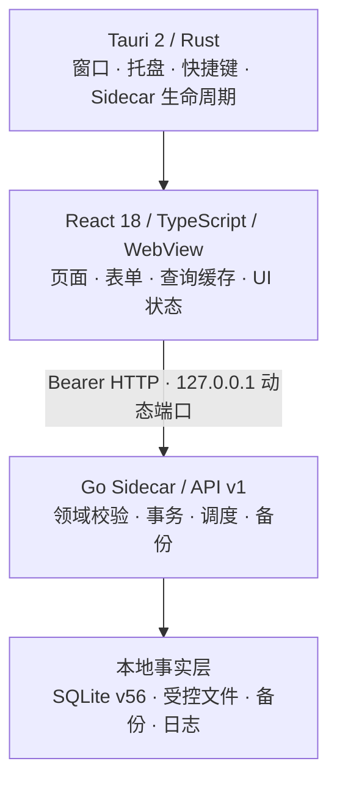

<div align="center">
  

  <h1>opc-workspace</h1>

  <p><strong>一人公司的本地优先工作台</strong></p>
  <p>在一个离线可用的桌面应用里，管理任务、项目、客户、收件箱、专注时间与本地业务数据。</p>

  <p>
    <a href="./README.md">简体中文</a>
    ·
    <a href="./README.en.md">English</a>
    ·
    <a href="./docs/README.md">产品文档</a>
    ·
    <a href="./docs/opc-workspace-PRD.md">PRD</a>
  </p>

  <p>
    
    
    
    
    
    
  </p>
</div>

> [!IMPORTANT]
> opc-workspace 仍处于积极开发阶段。当前基线为 app v0.1.1、API v1、SQLite schema v56；Windows x64 已能生成未签名的本地测试安装包，但尚未达到正式发布、签名和多平台完整验收标准。AI 助手作为独立轨道持续交付，不并入 v0.1–v0.4 的产品范围。

## 为什么做 opc-workspace

独立开发者、自由职业者、内容创作者和咨询顾问，往往需要在任务工具、项目表格、客户资料、计时器和内容日历之间来回切换。opc-workspace 希望把这些高频工作流收进一个轻量桌面应用，同时让业务数据默认留在自己的电脑上。

- **本地优先**：核心能力离线可用，业务事实保存在本机 SQLite 与受控文件目录中。
- **一个工作台**：任务、项目、客户、收件箱、专注与提醒围绕同一套业务事实协作。
- **可追溯工作流**：分派、状态变化、产出、验收和返工保留明确记录。
- **安装后无开发运行时依赖**：正式安装包内置 React 前端与 Go Sidecar；最终用户不需要 Docker、Node.js、Go 或 Rust。
- **键盘友好**：提供命令面板、快速新建和桌面全局快捷键。

`OPC` 取自 **one-person company**。项目关注的是一人经营场景，而不是把多人协作软件缩小一号。

## 核心能力

| 模块         | 当前能力                                                                       |
| ------------ | ------------------------------------------------------------------------------ |
| 今日工作台   | 聚合逾期、当天、本周稍后和未排期任务，支持排期、排序与快捷执行                 |
| 任务与验收   | 六状态任务生命周期、父子任务、责任分派、产出提交、人工验收与返工               |
| 项目与客户   | 项目进度、产出、附件、客户资料、活动、回访计划与关联视图                       |
| 收件箱与提醒 | 本地事项受理、稍后处理、任务拆分、完成进度与重复提醒                           |
| 专注与工时   | 可恢复的专注会话、任务绑定、历史记录、趋势、项目与标签统计                     |
| 搜索与命令   | 跨任务、项目、客户和活动收件箱的本地搜索与直达                                 |
| 数据安全     | 版本化迁移、受控文件、完整备份/恢复、业务 JSON/ZIP 导入导出与诊断              |
| 本地自动化   | 仅开放代码内置的受限预设；不提供任意 Shell、SQL、HTTP 或外发能力               |
| AI 助手      | 远程/本地 Provider、流式会话、推理展示、受控 Harness、长期记忆与建任务确认卡片 |

### 当前边界

- v0.1 的核心人工闭环正在持续完善，页面与接口的完成度以[模块状态总览](./docs/modules/README.md)为准。
- 收入、支出与发票目前仍是后续业务模块，不能视为已交付能力。
- AI 助手独立轨道已交付远程 Provider、本地回环 OpenAI 兼容 Provider、多 Provider 会话切换、流式回复与推理展示、生产零工具 Harness、长期记忆确认流和语义建任务确认卡片；知识库与长程上下文压缩仍未实现。
- 本地 Agent 目前只有受限 Adapter 登记与诊断，没有 Runner、Agent Run 或可执行任务能力。
- 当前没有云同步、多人账号、线上工作流或远程消息发送。

## 快速开始

### 开发环境

| 依赖           | 版本                                                      |
| -------------- | --------------------------------------------------------- |
| Node.js        | 20.19–26                                                  |
| pnpm           | 10+（仓库锁定 `pnpm@11.21.0`）                            |
| Go             | 1.22+                                                     |
| Rust           | 1.85+，通过 rustup/cargo 安装                             |
| Tauri 系统依赖 | 对应 Windows、macOS 或 Linux 平台的 Tauri 2 prerequisites |

Windows 桌面构建还需要 WebView2 Runtime、Visual Studio C++ Build Tools 与 Windows SDK。

### 安装依赖

```powershell
pnpm install
go -C services/sidecar mod download
```

### 启动桌面开发环境

```powershell
pnpm dev
```

统一开发脚本会启动 Go Sidecar、Vite 和 Tauri。开发数据保存在已忽略的 `.local/dev-data/`，不会写入正式应用数据目录，也不会自动生成演示业务数据。

只启动 Sidecar 与浏览器版前端：

```powershell
pnpm dev:web
```

## 构建与检查

```powershell
# 构建当前平台的 Sidecar、Web 前端和桌面安装包
pnpm build

# 不依赖 Rust 链接器的源码门禁
pnpm check:source

# 包含 Cargo check 与 Rust 测试的完整门禁
pnpm check
```

也可以按层运行 `pnpm check:web`、`pnpm check:go`、`pnpm check:rust` 或 `pnpm check:docs`。

当前 Windows x64 构建会生成：

```text
apps/desktop/src-tauri/target/release/bundle/nsis/opc-workspace_0.1.1_x64-setup.exe
apps/desktop/src-tauri/target/release/bundle/msi/opc-workspace_0.1.1_x64_zh-CN.msi
```

NSIS 当前仅内置简体中文，MSI 使用 `zh-CN`；两者都是未签名的本地测试包。跨平台发布仍应在对应平台或 CI runner 上构建，并完成干净系统中的安装、启动、升级、卸载和数据保留验收。

## 技术架构



生产环境中，Tauri 负责启动并监管内置 Go Sidecar。Sidecar 只监听回环地址，每个进程世代使用新的随机会话令牌；React 界面通过版本化 `/api/v1` 访问本地业务能力。数据库、附件、备份和日志保存在操作系统分配的应用数据目录中，与安装目录分离。

更完整的模块关系和安全边界见[整体功能架构](./docs/functional-architecture.md)、[本地 Agent Runtime ADR](./docs/adr/003-local-agent-runtime-security.md)与 [AI 助手模块文档](./docs/modules/ai-assistant.md)。

## 仓库结构

```text
apps/
  web/                    React 18 + TypeScript + Vite + Tailwind CSS v4
  desktop/                Tauri 2 桌面壳与 Rust 生命周期管理
services/
  sidecar/                Go HTTP API、SQLite、迁移、受控文件与测试
scripts/                  开发编排、构建、格式化和文档检查
docs/                     PRD、整体架构、ADR 与模块级功能文档
.local/dev-data/          本地开发数据（Git 已忽略）
```

## 文档

- [文档中心](./docs/README.md)：阅读顺序、事实优先级与模块状态总览。
- [产品需求文档（PRD v9.84）](./docs/opc-workspace-PRD.md)：产品范围、版本边界和实现追踪。
- [整体功能架构](./docs/functional-architecture.md)：模块关系、事件流和事实归属。
- [模块文档](./docs/modules/README.md)：每个模块的流程、API、状态、依赖与验收标准。
- [Sidecar 开发文档](./services/sidecar/README.md)：本地 API、数据与服务端验证说明。
- [English README](./README.en.md)：英文项目介绍与开发入口。

文档会区分“已实现”“部分完成”“页面骨架”和“后续规划”。遇到差异时，当前代码与测试是实现事实的最终依据，PRD 是产品范围与目标契约的依据。

## 参与贡献

项目仍在快速演进。提交较大改动前，建议先阅读[产品文档](./docs/README.md)，并通过 [GitHub Issues](https://github.com/DingxinTao0417/opc-workspace/issues) 对齐范围。功能变更需要同时更新对应的 PRD、架构或模块文档，并运行与风险相称的检查。

## 许可证

仓库目前尚未添加 `LICENSE` 文件。源码可见不等于已经获得复制、修改、再分发或商业使用授权；正式开放许可证需要由项目所有者另行确定。
